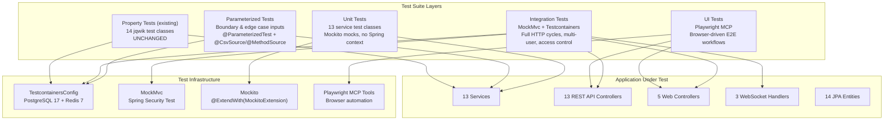
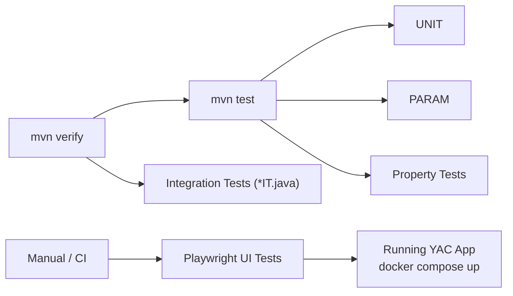

# Design Document: Comprehensive Test Suite for YAC

## Overview

This design defines a comprehensive test suite for the YAC (Yet Another Chat) Spring Boot 4 application. The existing test coverage is inadequate: 14 jqwik property-based tests exist and pass, 2 integration test classes cover 4 flows, and unit tests are completely absent. A critical 403 bug on room creation blocks manual testing.

The test suite adds four new test layers while preserving all existing tests:

1. **Unit tests** (Mockito) — 13 test classes, one per service, exercising business logic in isolation
2. **Parameterized tests** — boundary and edge case coverage for input-dependent correctness properties using `@ParameterizedTest`
3. **Integration tests** (MockMvc + Testcontainers) — full HTTP request/response cycles for all 13 REST API controllers, 5 web controllers, 3 WebSocket handlers, plus multi-user scenarios and access control verification
4. **UI tests** (Playwright MCP) — browser-driven end-to-end workflows for registration, login, room creation, messaging, and catalog search

Key design decisions:

- **Fix-first approach**: The 403 room creation bug must be resolved before integration and UI tests can validate room-related flows. The fix is scoped to CSRF configuration in `SecurityConfig` — API endpoints under `/api/**` need CSRF disabled since they use JSON payloads, not form submissions.
- **Shared Testcontainers infrastructure**: All integration and parameterized tests reuse the existing `TestcontainersConfig` (PostgreSQL 17 + Redis 7). No new containers needed.
- **No new dependencies**: Mockito, JUnit 5 parameterized, MockMvc, and Spring Security Test are already available via `spring-boot-starter-webmvc-test` and `spring-boot-starter-security-test`. Playwright is available via the MCP tools in the workspace.
- **Test isolation via `@Transactional`**: Integration tests roll back after each test. Redis state (presence) is cleaned up in `@AfterEach`.
- **Existing property tests untouched**: All 14 jqwik files in `src/test/java/com/bovae/yac/property/` remain as-is.

## Architecture



### Test Execution Flow



## Components and Interfaces

### Test Directory Structure

```
src/test/java/com/bovae/yac/
├── config/
│   └── TestcontainersConfig.java          # Shared containers (existing, unchanged)
├── unit/                                   # NEW: Mockito unit tests
│   ├── UserServiceTest.java
│   ├── AuthServiceTest.java
│   ├── PasswordServiceTest.java
│   ├── RoomServiceTest.java
│   ├── RoomMemberServiceTest.java
│   ├── ModerationServiceTest.java
│   ├── MessageServiceTest.java
│   ├── NotificationServiceTest.java
│   ├── DirectChatServiceTest.java
│   ├── FriendshipServiceTest.java
│   ├── UserBanServiceTest.java
│   ├── FileStorageServiceTest.java
│   └── PresenceServiceTest.java
├── parameterized/                          # NEW: Parameterized boundary tests
│   ├── RegistrationParameterizedTest.java
│   ├── MessageContentParameterizedTest.java
│   ├── PaginationParameterizedTest.java
│   └── UnreadCountParameterizedTest.java
├── integration/                            # EXPANDED: Integration tests
│   ├── RestApiIntegrationTest.java         # Existing (unchanged)
│   ├── PresenceNotificationIntegrationTest.java  # Existing (unchanged)
│   ├── RoomApiIT.java                      # NEW: Room CRUD, catalog, join/leave
│   ├── MessageApiIT.java                   # NEW: Message CRUD, pagination
│   ├── FriendshipApiIT.java                # NEW: Friend request lifecycle
│   ├── UserBanApiIT.java                   # NEW: Ban/unban, side effects
│   ├── ModerationApiIT.java                # NEW: Kick, ban, role management
│   ├── RoomInvitationApiIT.java            # NEW: Private room invitation flow
│   ├── DirectChatApiIT.java                # NEW: Direct chat creation/listing
│   ├── AttachmentApiIT.java                # NEW: File upload/download, access control
│   ├── PasswordApiIT.java                  # NEW: Password change/reset
│   ├── AccountDeletionApiIT.java           # NEW: Account deletion cascade
│   ├── SessionApiIT.java                   # NEW: Session list/terminate
│   ├── WebControllerIT.java                # NEW: Thymeleaf page rendering
│   ├── AccessControlIT.java                # NEW: Authorization enforcement
│   ├── MultiUserScenarioIT.java            # NEW: Cross-user interaction flows
│   ├── WebSocketIT.java                    # NEW: STOMP handler tests
│   └── ValidationErrorIT.java             # NEW: Input validation & error handling
├── property/                               # EXISTING: jqwik property tests (14 files, UNCHANGED)
│   ├── RegistrationPropertyTest.java
│   ├── AuthPropertyTest.java
│   ├── ... (14 files total)
│   └── WatermarkPropertyTest.java
└── e2e/                                    # NEW: Playwright UI test documentation
    └── README.md                           # Playwright workflow scripts (run via MCP)
```

### Unit Test Class Mapping

| Test Class | Service Under Test | Requirements | Correctness Properties |
|---|---|---|---|
| `UserServiceTest` | `UserService` | Req 1, 2, 4 | CP 1, 2, 3, 8 |
| `AuthServiceTest` | `AuthService` | Req 2 | CP 4, 5 |
| `PasswordServiceTest` | `PasswordService` | Req 3 | CP 6, 7 |
| `RoomServiceTest` | `RoomService` | Req 8, 9, 11 | CP 8, 12, 13 |
| `RoomMemberServiceTest` | `RoomMemberService` | Req 9, 10, 11 | CP 14, 15 |
| `ModerationServiceTest` | `ModerationService` | Req 12 | CP 16 |
| `MessageServiceTest` | `MessageService` | Req 13, 16 | CP 17, 18, 19, 22, 23 |
| `NotificationServiceTest` | `NotificationService` | Req 17 | CP 24 |
| `DirectChatServiceTest` | `DirectChatService` | Req 14 | CP 20 |
| `FriendshipServiceTest` | `FriendshipService` | Req 6 | CP 10 |
| `UserBanServiceTest` | `UserBanService` | Req 7 | CP 11 |
| `FileStorageServiceTest` | `FileStorageService` | Req 15 | CP 21 |
| `PresenceServiceTest` | `PresenceService` | Req 5 | CP 9 |

### Integration Test Class Mapping

| Test Class | Controller(s) Under Test | Requirements | Key Flows |
|---|---|---|---|
| `RoomApiIT` | `RoomApiController` | Req 1, 8, 9 | Create, catalog search, join, leave, delete; CSRF fix verification |
| `MessageApiIT` | `MessageApiController` | Req 13, 16 | Send, edit, delete, cursor-paginated history |
| `FriendshipApiIT` | `FriendshipApiController` | Req 6 | Request, accept, decline, list, remove |
| `UserBanApiIT` | `UserBanApiController` | Req 7 | Ban, unban, friendship termination side effect |
| `ModerationApiIT` | `RoomMemberApiController`, `RoomBanApiController` | Req 12 | Kick, ban, unban, role grant/revoke, message delete |
| `RoomInvitationApiIT` | `RoomInvitationApiController` | Req 10 | Invite, accept, decline; non-invited join rejection |
| `DirectChatApiIT` | `DirectChatApiController` | Req 14 | Create/get direct chat, list direct chats |
| `AttachmentApiIT` | `AttachmentApiController` | Req 15 | Upload, download, non-member access denial |
| `PasswordApiIT` | `PasswordApiController` | Req 3 | Reset request, reset confirm, change password |
| `AccountDeletionApiIT` | `UserApiController` | Req 4 | Delete account, verify cascade |
| `SessionApiIT` | `SessionApiController` | Req 2 | List sessions, terminate session |
| `WebControllerIT` | All 5 web controllers | Req 11 | Page rendering, auth redirects |
| `AccessControlIT` | All API controllers | Req 9 | Non-member, non-admin, unauthenticated access denial |
| `MultiUserScenarioIT` | Multiple controllers | Req 10 | Friend flow, ban flow, kick flow, cascade delete, message exchange |
| `WebSocketIT` | `ChatMessageHandler`, `PresenceHandler`, `TypingHandler` | Req 12 | STOMP send/receive, heartbeat, typing, error handling |
| `ValidationErrorIT` | `GlobalApiExceptionHandler` | Req 13 | Blank content, oversized messages, 404s, 409s, malformed UUIDs |

### CSRF Fix Design (Requirement 1)

The 403 on room creation is caused by missing CSRF meta tags in `rooms/create.html`. Every other Thymeleaf template includes:

```html
<meta name="_csrf" th:content="${_csrf.token}">
<meta name="_csrf_header" th:content="${_csrf.headerName}">
```

But `rooms/create.html` omits them. The JavaScript reads CSRF tokens from these meta tags via `document.querySelector('meta[name="_csrf"]')` — when the tags are missing, the token is empty, and Spring Security rejects the POST with 403.

The fix is adding the two CSRF meta tags to the `<head>` of `rooms/create.html`. CSRF protection remains enabled for all endpoints (except `/ws/**` which is already excluded). This is the correct security posture — the app uses session-based auth with Thymeleaf-rendered pages, so CSRF protection is essential.

Integration tests use `with(csrf())` in MockMvc to include CSRF tokens in test requests, matching the production behavior where JavaScript sends the token from meta tags.

## Data Models

No new entities or schema changes are required. The test suite operates against the existing 14 JPA entities.

### Test Data Patterns

Tests create data via service calls in `@BeforeEach`, not raw SQL. Common patterns:

```java
// Standard two-user setup for most integration tests
@BeforeEach
void setUp() {
    userA = userService.register("alice@test.com", "alice", "testpass123");
    userB = userService.register("bob@test.com", "bob", "testpass123");
}

// Room with owner + member setup
Room room = roomService.createRoom("test-room", "desc", RoomVisibility.PUBLIC, userA);
roomMemberService.joinPublicRoom(room, userB);

// Friendship setup
Friendship friendship = friendshipService.sendFriendRequest(userA, userB, null);
friendshipService.acceptFriendRequest(friendship.getId(), userB);
```

### MockMvc Authentication Pattern

```java
// Authenticated request with CSRF
mockMvc.perform(post("/api/rooms")
    .with(user(userA.getEmail()).roles("USER"))
    .with(csrf())
    .contentType(MediaType.APPLICATION_JSON)
    .content("""
        {"name": "test-room", "description": "desc", "visibility": "PUBLIC"}
        """))
    .andExpect(status().isCreated());
```

### JSON Field Naming

All assertions use snake_case to match the global Jackson `SnakeCaseStrategy`:
- `$.room_id`, `$.created_at`, `$.has_more`, `$.next_cursor`
- `$.messages[0].reply_to_id`, `$.messages[0].sender_id`

## Error Handling

The test suite validates the existing error handling infrastructure:

| Exception | HTTP Status | Test Coverage |
|---|---|---|
| `ResourceNotFoundException` | 404 | `ValidationErrorIT`: non-existent room, message, friendship |
| `ForbiddenException` | 403 | `AccessControlIT`: non-member, non-admin, banned user actions |
| `ConflictException` | 409 | `ValidationErrorIT`: duplicate room name, duplicate email/username |
| `FileStorageException` | 400 | `AttachmentApiIT`: oversized file upload |
| `MethodArgumentNotValidException` | 400 | `ValidationErrorIT`: blank content, blank room name, oversized fields |
| `ConstraintViolationException` | 400 | `ValidationErrorIT`: malformed UUID path variables |
| Spring Security 401 | 401 | `AccessControlIT`: unauthenticated access to `/api/**` |

### WebSocket Error Testing

`WebSocketIT` verifies that `ChatMessageHandler.handleException()` sends error payloads to `/user/queue/errors` when message sending fails (e.g., non-member sends to room, message content exceeds limit).

## Testing Strategy

### Why Property-Based Testing Does Not Apply to This Feature

This feature's deliverable is test code — unit tests, integration tests, parameterized tests, and UI test scripts. The acceptance criteria describe what test classes should exist and what behaviors they should verify (e.g., "THE Unit_Test for UserService SHALL verify that registration with a duplicate email throws ConflictException"). These are specifications for test artifacts, not application behaviors that vary meaningfully with input.

PBT requires a "for all inputs X, property P(X) holds" statement about code under test. Since the code under test here IS the test suite itself, PBT is not applicable. The existing 14 jqwik property-based tests already cover the application's correctness properties and remain unchanged.

### Test Layers and Their Roles

| Layer | Purpose | Runner | Count |
|---|---|---|---|
| Unit tests | Verify service-layer business logic in isolation with Mockito mocks | `mvn test` | ~13 classes, ~80 test methods |
| Parameterized tests | Verify input-dependent behavior with explicit boundary values | `mvn test` | ~4 classes, ~20 test methods |
| Property tests (existing) | Verify universal correctness properties across random inputs | `mvn test` | 14 classes (unchanged) |
| Integration tests | Verify full HTTP cycles, multi-user flows, access control, WebSocket | `mvn verify` | ~16 classes, ~120 test methods |
| UI tests | Verify browser-driven user workflows | Manual/CI | ~7 Playwright scenarios |

### Unit Test Conventions

- Annotated with `@ExtendWith(MockitoExtension.class)` — no Spring context
- One test class per service, named `{Service}Test.java`
- Dependencies mocked with `@Mock`, service under test with `@InjectMocks`
- Each test method documents which Correctness Property it validates via Javadoc
- Cover: happy path, error paths (exception assertions), edge cases (null, empty, boundary)

### Parameterized Test Conventions

- Use `@ParameterizedTest` with `@CsvSource` or `@MethodSource`
- Minimum 5 representative values per parameter including boundary cases
- Organized by domain area, not by service
- Run as part of `mvn test` (not integration tests)

### Integration Test Conventions

- Annotated with `@SpringBootTest`, `@AutoConfigureMockMvc`, `@Import(TestcontainersConfig.class)`, `@Transactional`
- Named `*IT.java` for failsafe plugin recognition
- Test data created via service calls in `@BeforeEach`
- Authenticate with `with(user("email").roles("USER"))` and `with(csrf())`
- Assert HTTP status codes and JSON body via `jsonPath()`
- Redis state cleaned in `@AfterEach` where applicable

### UI Test Conventions

- Driven via Playwright MCP tools (browser snapshot, click, type, navigate)
- Require the application to be running (`docker compose up`)
- Documented as step-by-step workflows in `src/test/e2e/README.md`
- Cover: registration, login, room creation, messaging, catalog search, logout

### Test Execution

```bash
./mvnw test          # Unit + parameterized + property tests
./mvnw verify        # All above + integration tests
make test            # Alias for clean verify
```

### Coverage Goals

- Every service method has at least one unit test for happy path and one for primary error path
- Every REST API endpoint has at least one integration test
- Every access control boundary (non-member, non-admin, unauthenticated, banned) has a dedicated test
- All 24 correctness properties from the original design are validated by at least one test (unit, parameterized, integration, or existing property test)
- All 15 requirements from this spec's requirements document are covered
