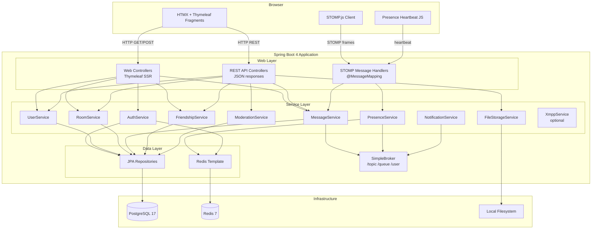
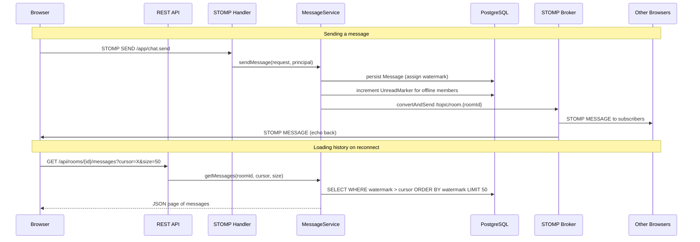
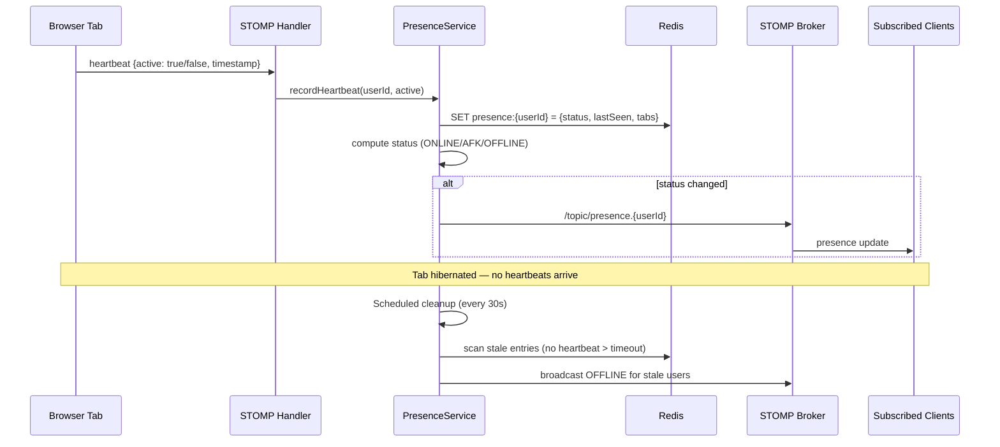

# Design Document: Online Chat Server (YAC)

## Overview

YAC (Yet Another Chat) is a classic web-based chat application built on Spring Boot 4 with a hybrid REST + WebSocket architecture. The server renders HTML via Thymeleaf + HTMX for page structure and CRUD operations, while STOMP over WebSocket handles real-time message delivery and presence updates. PostgreSQL provides persistent storage, Redis backs HTTP sessions and presence state, and the local filesystem stores uploaded files.

The system targets up to 300 simultaneous users, rooms with up to 1000 members, and message histories exceeding 100K messages per room. Key design decisions:

- **Hybrid REST + WebSocket**: REST for CRUD, history loading, file uploads; WebSocket for real-time message broadcast and presence. This avoids the complexity of a pure-WebSocket app while keeping message delivery fast.
- **Watermark-based history integrity**: Each room maintains a monotonically increasing sequence number. Clients detect gaps and re-query missing ranges via cursor-based pagination.
- **Heartbeat-based presence**: Browser tabs send periodic heartbeats with an `active` flag derived from cursor movement. Absence of heartbeats (e.g., tab hibernation) is treated as inactivity — no explicit "inactive" signal required.
- **No unbounded queues**: Offline users receive messages via cursor-based history queries on reconnect, not from accumulated message queues.
- **Optional XMPP federation**: Jabber support is a pluggable module using an existing Java XMPP library.

## Architecture



### Communication Flow



### Presence Flow



## Components and Interfaces

### Web Controllers (Thymeleaf SSR)

| Controller | Path | Purpose |
|---|---|---|
| `AuthWebController` | `/login`, `/register`, `/forgot-password` | Auth pages (exists) |
| `ChatWebController` | `/chat`, `/chat/rooms/{id}` | Main chat SPA shell |
| `ProfileWebController` | `/profile`, `/profile/sessions` | Profile & session management |
| `RoomWebController` | `/rooms/catalog`, `/rooms/create` | Room catalog & creation forms |

### REST API Controllers

| Controller | Base Path | Key Endpoints |
|---|---|---|
| `MessageApiController` | `/api/rooms/{roomId}/messages` | `GET` (cursor-paginated history), `POST` (send), `PUT /{id}` (edit), `DELETE /{id}` |
| `RoomApiController` | `/api/rooms` | `GET` (catalog search), `POST` (create), `DELETE /{id}`, `POST /{id}/join`, `POST /{id}/leave` |
| `RoomMemberApiController` | `/api/rooms/{roomId}/members` | `GET` (list), `DELETE /{userId}` (kick), `PUT /{userId}/role` (promote/demote) |
| `RoomBanApiController` | `/api/rooms/{roomId}/bans` | `GET` (list), `POST` (ban), `DELETE /{userId}` (unban) |
| `RoomInvitationApiController` | `/api/rooms/{roomId}/invitations` | `POST` (invite), `POST /{id}/accept`, `DELETE /{id}` (decline) |
| `FriendshipApiController` | `/api/friends` | `GET` (list), `POST /request` (send), `POST /{id}/accept`, `POST /{id}/decline`, `DELETE /{id}` |
| `UserBanApiController` | `/api/user-bans` | `POST` (ban), `DELETE /{id}` (unban) |
| `AttachmentApiController` | `/api/rooms/{roomId}/attachments` | `POST` (upload), `GET /{id}/download` |
| `DirectChatApiController` | `/api/direct-chats` | `POST` (create/get), `GET` (list) |
| `UserApiController` | `/api/users` | `GET /search` (by username), `DELETE /me` (account deletion) |
| `SessionApiController` | `/api/sessions` | `GET` (list active), `DELETE /{id}` (terminate) |
| `PasswordApiController` | `/api/password` | `POST /reset-request`, `POST /reset`, `POST /change` |

### STOMP Message Handlers

| Handler | Destination | Purpose |
|---|---|---|
| `ChatMessageHandler` | `/app/chat.send` | Receive new messages, persist, broadcast |
| `PresenceHandler` | `/app/presence.heartbeat` | Receive heartbeats, update presence |
| `TypingHandler` | `/app/typing` | Broadcast typing indicators (optional) |

### STOMP Subscription Topics

| Topic | Pattern | Payload |
|---|---|---|
| Room messages | `/topic/room.{roomId}` | `ChatMessageResponse` |
| Presence updates | `/topic/presence.{userId}` | `PresenceUpdate` |
| User notifications | `/user/queue/notifications` | `NotificationEvent` (unread counts, friend requests, invitations) |
| Room events | `/topic/room.{roomId}.events` | `RoomEvent` (member join/leave, ban, role change) |

### Service Layer

| Service | Responsibilities |
|---|---|
| `UserService` | Registration, profile, account deletion cascade |
| `AuthService` | Login validation, session management, remember-me |
| `PasswordService` | Reset token generation/validation, password change |
| `RoomService` | CRUD, visibility rules, ownership enforcement, deletion cascade |
| `RoomMemberService` | Join/leave, role management, membership checks |
| `MessageService` | Send, edit, delete, cursor-paginated history, watermark assignment |
| `FriendshipService` | Request/accept/decline/remove, friendship validation |
| `UserBanService` | Ban/unban, friendship termination, direct chat freeze |
| `ModerationService` | Admin actions: kick, ban, unban, message deletion, role changes |
| `FileStorageService` | Upload, download, access control, size validation |
| `PresenceService` | Heartbeat processing, status computation, scheduled cleanup |
| `NotificationService` | Unread marker management, real-time notification dispatch |
| `XmppService` | (Optional) XMPP client connections, S2S federation |

## Data Models

### Existing Entities (already scaffolded)

The following JPA entities exist with their current schema. The design extends them where noted.

#### User
- `id: UUID` (PK), `email: String` (unique), `username: String` (unique, immutable, max 50), `displayName: String` (max 100), `passwordHash: String`
- Extends `BaseEntity` (createdAt, updatedAt)

#### Room
- `id: UUID` (PK), `name: String` (unique, max 100), `description: String`, `visibility: RoomVisibility` (PUBLIC/PRIVATE/DIRECT), `owner: User` (FK)
- Extends `BaseEntity`

#### Message
- `id: UUID` (PK), `room: Room` (FK), `sender: User` (FK), `content: String` (max 3072 bytes), `replyTo: Message` (FK, nullable), `edited: boolean`
- Extends `BaseEntity`
- **New field needed**: `watermark: Long` — monotonically increasing per-room sequence number

#### RoomMember
- Composite PK: `(room: Room, user: User)`, `role: RoomRole` (OWNER/ADMIN/MEMBER), `joinedAt: Instant`

#### Friendship
- `id: UUID` (PK), `requester: User` (FK), `recipient: User` (FK), `status: FriendshipStatus` (PENDING/ACCEPTED/DECLINED), `requestText: String`
- Extends `BaseEntity`

#### Attachment
- `id: UUID` (PK), `message: Message` (FK), `originalFileName: String`, `storagePath: String`, `fileSize: long`, `contentType: String`, `comment: String`, `createdAt: Instant`

#### UnreadMarker
- Composite PK: `(user: User, room: Room)`, `lastReadMessage: Message` (FK, nullable), `unreadCount: int`

#### RoomBan
- `id: UUID` (PK), `room: Room` (FK), `user: User` (FK), `bannedBy: User` (FK), `createdAt: Instant`
- Unique constraint on (room_id, user_id)

#### RoomInvitation
- `id: UUID` (PK), `room: Room` (FK), `inviter: User` (FK), `invitee: User` (FK), `createdAt: Instant`
- Unique constraint on (room_id, invitee_id)

#### UserBan
- `id: UUID` (PK), `blocker: User` (FK), `blocked: User` (FK), `createdAt: Instant`
- Unique constraint on (blocker_id, blocked_id)

### New/Modified Entities

#### Message (modification)
Add `watermark` column:
```java
@Column(nullable = false)
private Long watermark;
```
The watermark is assigned at persist time using a per-room PostgreSQL sequence or an `@PrePersist` hook that increments atomically via `SELECT ... FOR UPDATE` on a room-level counter.

#### Room (modification)
Add watermark counter:
```java
@Column(name = "next_watermark", nullable = false)
private Long nextWatermark = 1L;
```

#### UnreadMarker (modification)
Replace `unreadCount` with on-demand computation. Store only `lastReadWatermark`:
```java
@Column(name = "last_read_watermark")
private Long lastReadWatermark;
```
Unread count is computed as: `room.nextWatermark - 1 - lastReadWatermark`, capped at a display maximum (e.g., 999). This prevents unbounded accumulation for dormant users.

#### PasswordResetToken (new)
```java
@Entity
@Table(name = "password_reset_tokens")
public class PasswordResetToken {
    @Id
    private UUID id;
    @ManyToOne(fetch = FetchType.LAZY)
    @JoinColumn(name = "user_id", nullable = false)
    private User user;
    @Column(name = "token_hash", nullable = false, unique = true)
    private String tokenHash;
    @Column(name = "expires_at", nullable = false)
    private Instant expiresAt;
    @Column(name = "used", nullable = false)
    private boolean used;
    @CreationTimestamp
    @Column(name = "created_at", nullable = false, updatable = false)
    private Instant createdAt;
}
```

### Key DTOs (records per Java conventions)

```java
// Message pagination request
public record MessagePageRequest(
    @NotNull UUID roomId,
    Long cursor,        // watermark cursor, null = latest
    @Max(100) int size  // default 50
) {}

// Message pagination response
public record MessagePage(
    List<ChatMessageResponse> messages,
    Long nextCursor,    // null if no more
    boolean hasMore
) {}

// Presence update broadcast
public record PresenceUpdate(
    UUID userId,
    String username,
    PresenceStatus status,
    Instant timestamp
) {}

// Room catalog entry
public record RoomCatalogEntry(
    UUID id,
    String name,
    String description,
    int memberCount
) {}
```

### Redis Data Structures

| Key Pattern | Type | TTL | Purpose |
|---|---|---|---|
| `presence:{userId}` | Hash | 90s | `{status, lastHeartbeat, activeTabs}` — expires if no heartbeat |
| `spring:session:yac:*` | Hash | 30d | Spring Session data (existing) |

### Database Indexes

```sql
-- Message history cursor pagination (critical for 100K+ rooms)
CREATE INDEX idx_messages_room_watermark ON messages (room_id, watermark);

-- Catalog search
CREATE INDEX idx_rooms_visibility_name ON rooms (visibility, name);

-- Unread computation
CREATE INDEX idx_unread_markers_user ON unread_markers (user_id);

-- Friendship lookups
CREATE INDEX idx_friendships_requester ON friendships (requester_id, status);
CREATE INDEX idx_friendships_recipient ON friendships (recipient_id, status);

-- Room ban checks (join-time validation)
CREATE INDEX idx_room_bans_room_user ON room_bans (room_id, user_id);

-- User ban checks (message-time validation)
CREATE INDEX idx_user_bans_blocker ON user_bans (blocker_id, blocked_id);
CREATE INDEX idx_user_bans_blocked ON user_bans (blocked_id, blocker_id);

-- Room members by room (for broadcast recipient lookup)
CREATE INDEX idx_room_members_room ON room_members (room_id);
```


## Correctness Properties

*A property is a characteristic or behavior that should hold true across all valid executions of a system — essentially, a formal statement about what the system should do. Properties serve as the bridge between human-readable specifications and machine-verifiable correctness guarantees.*

### Property 1: Registration uniqueness enforcement

*For any* existing User in the system, attempting to register a new account with the same email OR the same username SHALL be rejected, and no new User record SHALL be created.

**Validates: Requirements 1.2, 1.3**

### Property 2: Password hash round-trip

*For any* valid password submitted during registration, the stored `passwordHash` SHALL be a valid BCrypt hash, and `BCrypt.checkpw(plaintext, storedHash)` SHALL return true.

**Validates: Requirements 1.4**

### Property 3: Username immutability

*For any* registered User, any attempt to modify the `username` field SHALL be rejected, and the username SHALL remain equal to the value set at registration time.

**Validates: Requirements 1.5**

### Property 4: Authentication round-trip

*For any* registered User with a known password, login with the correct email and password SHALL succeed, and login with any incorrect password SHALL fail.

**Validates: Requirements 2.1, 2.2**

### Property 5: Session isolation

*For any* User with N active sessions (N ≥ 2), terminating or signing out of one specific session SHALL invalidate only that session, leaving the remaining N-1 sessions valid and listed.

**Validates: Requirements 2.4, 2.5, 2.6**

### Property 6: Password change authorization

*For any* logged-in User, a password change request SHALL succeed if and only if the provided current password matches the stored hash. On success, the new password SHALL authenticate; on failure, the old password SHALL remain valid.

**Validates: Requirements 3.3, 3.4**

### Property 7: Password reset token lifecycle

*For any* registered User, requesting a password reset SHALL create a token. Using that token with a new password SHALL update the hash (verifiable via login) and invalidate the token so it cannot be reused.

**Validates: Requirements 3.1, 3.2**

### Property 8: Account deletion cascade

*For any* User who owns R rooms and is a member of M other rooms, deleting the account SHALL remove the User record, delete all R owned rooms (with their messages, attachments, members, bans, and invitations), and remove the User's membership from all M other rooms.

**Validates: Requirements 4.1, 4.2, 4.3, 4.4, 11.3, 11.4**

### Property 9: Presence status computation

*For any* set of heartbeat records for a User, the computed presence status SHALL be: ONLINE if at least one tab sent an active heartbeat within the last heartbeat interval; AFK if all tabs have been inactive for more than 1 minute but heartbeats are still arriving; OFFLINE if no heartbeats have been received within the timeout window.

**Validates: Requirements 5.1, 5.2, 5.3, 5.6**

### Property 10: Friendship lifecycle state transitions

*For any* friend request between two Users, the Friendship SHALL be created with PENDING status and optional request text. Accepting SHALL transition to ACCEPTED; declining SHALL transition to DECLINED. Removing an ACCEPTED friendship SHALL delete the record.

**Validates: Requirements 6.1, 6.2, 6.3, 6.4, 6.5**

### Property 11: UserBan access control enforcement

*For any* UserBan where User A blocks User B, User B SHALL be unable to send messages or friend requests to User A. If a Friendship existed, it SHALL be deleted. If a Direct_Chat existed, it SHALL become read-only (messages rejected, history preserved). Removing the UserBan SHALL restore the ability to send friend requests.

**Validates: Requirements 7.1, 7.2, 7.3, 7.4, 7.5, 14.3**

### Property 12: Room creation invariants

*For any* valid room creation request with a unique name, the system SHALL create the Room, assign the creator as Owner, and add a RoomMember record with OWNER role. The room SHALL have exactly one Owner at all times.

**Validates: Requirements 8.1, 8.2, 8.3, 8.4**

### Property 13: Room catalog visibility filtering

*For any* set of Rooms with mixed visibility, the public catalog SHALL return exactly the PUBLIC rooms and SHALL exclude all PRIVATE and DIRECT rooms. Search filtering SHALL return only rooms whose name or description matches the search term.

**Validates: Requirements 9.1, 9.2, 10.1**

### Property 14: Room join access control

*For any* authenticated User attempting to join a room: joining a PUBLIC room SHALL succeed if and only if no RoomBan exists for that User; joining a PRIVATE room SHALL succeed if and only if a RoomInvitation exists. Accepting an invitation SHALL add the User as Member and delete the RoomInvitation.

**Validates: Requirements 9.3, 9.4, 10.3, 10.4**

### Property 15: Room membership lifecycle

*For any* non-Owner Member, leaving a Room SHALL remove the RoomMember record. *For any* Owner, attempting to leave SHALL be rejected. *For any* User who loses room access, that User SHALL be denied access to messages and attachments from that Room.

**Validates: Requirements 11.1, 11.2, 11.5**

### Property 16: Admin moderation actions

*For any* Admin action to remove a Member, the system SHALL create a RoomBan and delete the RoomMember. Removing a ban SHALL delete the RoomBan. Admin message deletion SHALL permanently remove the Message. Demoting the Owner SHALL be rejected. The Owner SHALL be able to grant and revoke Admin role for any Member. An Admin SHALL be able to demote another non-Owner Admin to Member.

**Validates: Requirements 12.1, 12.3, 12.4, 12.6, 12.7, 12.8**

### Property 17: Message content round-trip

*For any* valid message content (plain text, multiline, emoji, up to 3072 UTF-8 bytes) sent to a Room, the persisted Message SHALL contain the exact same content. Messages with a replyTo reference SHALL store the correct FK. Messages exceeding 3072 bytes SHALL be rejected.

**Validates: Requirements 13.1, 13.2, 13.3, 13.8**

### Property 18: Message edit invariant

*For any* Message edited by its author, the content SHALL be updated to the new value and the `edited` flag SHALL be set to true.

**Validates: Requirements 13.4**

### Property 19: Message deletion by author

*For any* Message, the original author SHALL be able to delete it permanently, and the Message SHALL no longer be retrievable.

**Validates: Requirements 13.6**

### Property 20: Direct chat access control

*For any* two Users, a Direct_Chat SHALL be creatable if and only if they are friends and no mutual UserBan exists. Non-friends SHALL be rejected. Direct_Chats SHALL have no admin moderation capabilities (kick, ban, delete others' messages all rejected).

**Validates: Requirements 14.1, 14.2, 14.5**

### Property 21: Attachment upload and access control

*For any* file upload within size limits (≤20MB for files, ≤3MB for images), the system SHALL store the file, create an Attachment record preserving the original file name and optional comment. Download SHALL succeed if and only if the requester is a current Room Member.

**Validates: Requirements 15.1, 15.2, 15.5, 15.6, 15.8, 15.9**

### Property 22: Watermark monotonicity and message ordering

*For any* sequence of Messages persisted in a Room, each Message SHALL receive a watermark strictly greater than the previous. Retrieving messages SHALL return them ordered by watermark.

**Validates: Requirements 16.1, 16.4**

### Property 23: Cursor-based pagination correctness

*For any* Room with N messages and a cursor value C, querying messages with cursor C and page size S SHALL return exactly the messages with watermark > C, limited to S results, ordered by watermark ascending. The response SHALL include a nextCursor pointing to the last returned watermark, and `hasMore` SHALL be true iff more messages exist beyond the page.

**Validates: Requirements 16.2, 16.5**

### Property 24: Unread count computation

*For any* User and Room, the unread count SHALL equal `min(room.nextWatermark - 1 - lastReadWatermark, displayCap)`. Opening the Room SHALL update `lastReadWatermark` to the current watermark, making the unread count zero.

**Validates: Requirements 17.1, 17.2, 17.4**

## Error Handling

### Error Categories

| Category | HTTP Status | Exception | Handling |
|---|---|---|---|
| Resource not found | 404 | `ResourceNotFoundException` | Room, User, Message, Attachment, Friendship, Invitation not found |
| Access denied | 403 | `ForbiddenException` | Non-member access, banned user actions, non-admin moderation attempts, UserBan violations |
| Validation failure | 400 | `MethodArgumentNotValidException` / `ConstraintViolationException` | Invalid input, duplicate names/emails, message too large, file too large |
| File storage error | 400 | `FileStorageException` | Upload failures, filesystem errors |
| Conflict | 409 | `ConflictException` (new) | Duplicate room name, duplicate email/username, already a member, already friends |
| Unauthorized | 401 | Spring Security | Unauthenticated access attempts |
| Server error | 500 | `Exception` (catch-all) | Unexpected failures |

### Error Handling Strategy

- **Web controllers** (`@ControllerAdvice`): Return Thymeleaf error pages (403.html, 404.html, 500.html) — already implemented in `GlobalWebExceptionHandler`.
- **API controllers** (`@RestControllerAdvice`): Return JSON `ErrorResponse` with timestamp, status, message, path — already implemented in `GlobalApiExceptionHandler`.
- **WebSocket handlers**: Errors in `@MessageMapping` methods are caught and sent back to the user via `/user/queue/errors` as a JSON error payload. The STOMP connection is not terminated on application-level errors.
- **Cascade operations** (account deletion, room deletion): Wrapped in `@Transactional` to ensure atomicity. If any step fails, the entire operation rolls back.
- **File upload errors**: Validated before persistence — size checks happen before writing to disk. If filesystem write fails after DB persist, the transaction rolls back and any partial file is cleaned up.
- **Presence errors**: Heartbeat processing failures are logged but do not propagate to the client. Presence is eventually consistent — a missed heartbeat simply delays the status update.

### WebSocket Error Channel

```java
// Error messages sent to individual users
@MessageExceptionHandler
public void handleException(Exception ex, Principal principal) {
    messagingTemplate.convertAndSendToUser(
        principal.getName(),
        "/queue/errors",
        new ErrorResponse(Instant.now(), 400, ex.getMessage(), null)
    );
}
```

## Testing Strategy

### Dual Testing Approach

The testing strategy combines unit tests, property-based tests, and integration tests for comprehensive coverage.

### Property-Based Testing

**Library**: [jqwik](https://jqwik.net/) — the standard PBT library for JUnit 5 on the JVM.

**Configuration**:
- Minimum 100 iterations per property test (`@Property(tries = 100)`)
- Each test references its design document property via tag comment
- Tag format: `Feature: online-chat-server, Property {number}: {title}`

**Scope**: Properties 1–24 from the Correctness Properties section above. Each property maps to one or more `@Property` test methods in jqwik.

**Test organization**:
- `src/test/java/com/bovae/yac/property/` — property-based tests
  - `RegistrationPropertyTest` — Properties 1, 2, 3
  - `AuthPropertyTest` — Properties 4, 5, 6, 7
  - `AccountDeletionPropertyTest` — Property 8
  - `PresencePropertyTest` — Property 9
  - `FriendshipPropertyTest` — Property 10
  - `UserBanPropertyTest` — Property 11
  - `RoomPropertyTest` — Properties 12, 13, 14, 15
  - `ModerationPropertyTest` — Property 16
  - `MessagePropertyTest` — Properties 17, 18, 19
  - `DirectChatPropertyTest` — Property 20
  - `AttachmentPropertyTest` — Property 21
  - `WatermarkPropertyTest` — Properties 22, 23
  - `UnreadPropertyTest` — Property 24

**Generators**: Custom jqwik `@Provide` arbitraries for:
- Valid/invalid email addresses, usernames, passwords
- Message content with varying byte lengths, multiline, emoji
- Room configurations (visibility, name, description)
- Friendship state machines
- Heartbeat sequences with timestamps
- File metadata (names, sizes, content types)

### Unit Tests

Focus on specific examples, edge cases, and error conditions not covered by PBT:
- Boundary values (exactly 3072 bytes, exactly 20MB, exactly 3MB)
- Empty/null inputs at API boundaries
- Concurrent operations (two users joining same room simultaneously)
- Cascade ordering (delete user with rooms that have messages with attachments)
- WebSocket message handler error paths

### Integration Tests

Using Testcontainers (PostgreSQL + Redis, already in pom.xml):
- Full HTTP request/response cycles through controllers
- WebSocket STOMP message flow end-to-end
- Session persistence in Redis
- File upload/download through the filesystem
- Cursor-based pagination with large datasets (100K+ messages)
- Presence heartbeat → status change → broadcast flow
- Account deletion cascade across all related tables

### Performance Tests

- Room with 100K messages: verify pagination response time < 200ms
- 300 concurrent WebSocket connections: verify message delivery < 3s
- Presence updates for 300 users: verify propagation < 2s

### XMPP Tests (optional module)

- XMPP client connection and authentication
- S2S federation message exchange between two Docker instances
- Load test: 50+ clients per server, bidirectional messaging
