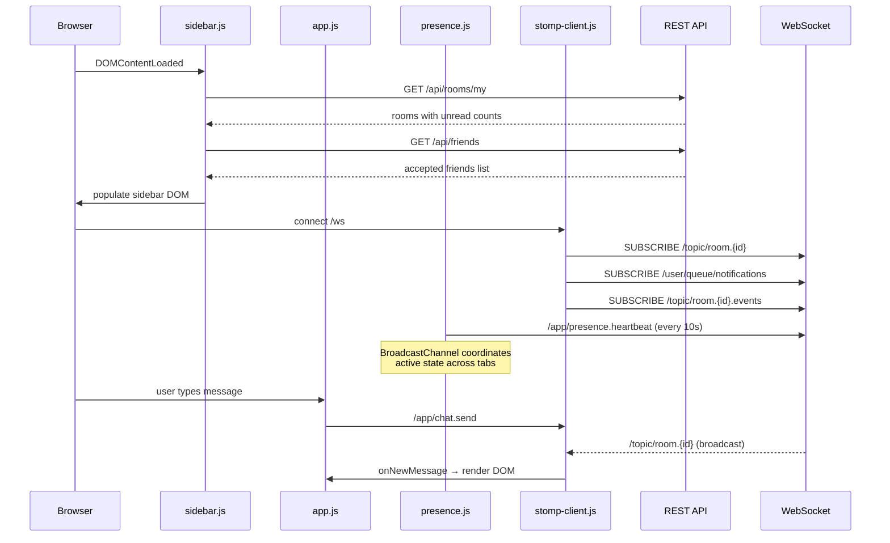

# Design Document: UI Completion and Fixes

## Overview

This design covers 18 discrete items of missing or broken UI functionality in the YAC chat application. The work spans four categories:

1. **Missing pages/templates**: Password reset page (Req 1)
2. **Missing/incomplete API endpoints**: Room update PUT (Req 2), friend request text passthrough bug (Req 3), profile update PUT (Req 10), pending friend request listing (Req 13), attachment metadata in message DTO (Req 15)
3. **Missing JavaScript logic**: Sidebar population (Req 4), emoji picker (Req 5), typing indicators (Req 6), message edit UI (Req 7), message delete wiring (Req 8), banned users modal (Req 9), profile form submission (Req 10), sidebar search (Req 11), friend request from member list (Req 12), friend request panel (Req 13), DM from contacts (Req 14), attachment rendering (Req 15), leave room button (Req 16), AFK multi-tab coordination (Req 17)
4. **Template fixes**: Navbar link corrections (Req 18)

All changes target the existing stack: Spring Boot 4 + Thymeleaf + Bootstrap 5.3 + STOMP.js + vanilla JS. No new external dependencies are introduced.

## Architecture

The application follows a layered architecture that this design preserves:

```
┌─────────────────────────────────────────────────────┐
│  Thymeleaf Templates + Fragments                    │
│  (navbar, sidebar, message-input, member-list, etc) │
├─────────────────────────────────────────────────────┤
│  Static JS (app.js, stomp-client.js, presence.js)   │
│  + new: sidebar.js, emoji.js, typing.js, profile.js │
├─────────────────────────────────────────────────────┤
│  REST API Controllers (/api/*)                      │
│  Web Controllers (Thymeleaf views)                  │
├─────────────────────────────────────────────────────┤
│  Service Layer                                      │
├─────────────────────────────────────────────────────┤
│  JPA Repositories + Redis                           │
└─────────────────────────────────────────────────────┘
```

### Key Design Decisions

1. **JS file organization**: New JS modules (`sidebar.js`, `emoji.js`, `typing.js`, `profile.js`) are added as separate IIFE files exposing their API on `window.YAC.*`, rather than bloating `app.js`. This keeps each concern isolated and cacheable.
2. **No npm/Node.js**: All JS remains vanilla, loaded via `<script>` tags from `/js/*` and WebJars.
3. **No external emoji library**: The emoji picker uses a hardcoded array of common Unicode emoji characters rendered in a simple CSS grid popup. This satisfies Req 5.5 and avoids a new dependency.
4. **BroadcastChannel for AFK**: Multi-tab coordination uses `BroadcastChannel` API with `localStorage` fallback, integrated into the existing `presence.js` module. No new JS file needed for this.
5. **Attachment metadata in DTO**: `ChatMessageResponse` is extended with an `attachments` list to avoid N+1 supplementary API calls from the frontend. The `MessageService.toResponse()` method eagerly loads attachments.
6. **Current user ID in JS context**: `room.html` and `index.html` expose `window.YAC_USER = { id: '...' }` so client-side JS can distinguish own messages/events without additional API calls.
7. **Sidebar data loading**: The sidebar fetches data via REST API on page load rather than server-side Thymeleaf rendering. This allows the same sidebar fragment to work on both `/chat` and `/chat/rooms/{id}` without duplicating controller model attributes.

### Component Interaction Flow



## Components and Interfaces

### Backend Changes

#### Req 1: Password Reset Page

**New template**: `src/main/resources/templates/auth/reset-password.html`
- Form with token (pre-filled from `?token=` query param), new password, confirm password fields
- Client-side password match validation via inline `<script>`
- POST to `/api/password/reset` via `fetch()`, displays success/error inline
- Success state shows link to `/login`

**AuthWebController change**:
```java
@GetMapping("/reset-password")
public String resetPassword(@RequestParam(required = false) String token, Model model) {
    model.addAttribute("token", token);
    return "auth/reset-password";
}
```

**SecurityConfig change**: Add `/reset-password` to the `permitAll()` list so unauthenticated users can access it.

#### Req 2: Room Update Endpoint + Settings UI

**New DTO**:
```java
public record UpdateRoomRequest(
    String name,
    String description,
    RoomVisibility visibility
) {}
```

**RoomService addition**:
```java
@Transactional
public RoomDto updateRoom(UUID roomId, User owner, String name, String description, RoomVisibility visibility) {
    Room room = roomRepository.findById(roomId)
            .orElseThrow(() -> new ResourceNotFoundException("Room not found: %s".formatted(roomId)));

    if (!room.getOwner().getId().equals(owner.getId())) {
        throw new ForbiddenException("Only the room owner can update the room");
    }

    if (name != null && !name.equals(room.getName()) && roomRepository.existsByName(name)) {
        throw new ConflictException("Room name is already taken: %s".formatted(name));
    }

    if (name != null) { room.setName(name); }
    if (description != null) { room.setDescription(description); }
    if (visibility != null) { room.setVisibility(visibility); }

    return roomMapper.toDto(roomRepository.save(room));
}
```

**RoomApiController addition**:
```java
@PutMapping("/{id}")
public ResponseEntity<RoomDto> updateRoom(
        @PathVariable UUID id,
        @Valid @RequestBody UpdateRoomRequest request,
        Principal principal) {
    User user = resolveUser(principal);
    RoomDto updated = roomService.updateRoom(id, user, request.name(), request.description(), request.visibility());
    return ResponseEntity.ok(updated);
}
```

**Template changes**: Add a "Room Settings" modal to `admin-modals.html` with pre-filled fields for name, description, and visibility. Add a "Settings" button to `member-list.html` visible only to the room owner. JS in `app.js` handles the PUT request and updates the room header on success.

#### Req 3: Friend Request Text Passthrough

**SendFriendRequest modification**:
```java
public record SendFriendRequest(
    @NotBlank String username,
    String requestText  // new, optional
) {}
```

**FriendshipApiController.sendFriendRequest fix**: Change the hardcoded `null` to `request.requestText()`:
```java
friendshipService.sendFriendRequest(requester, recipient, request.requestText());
```

#### Req 4: Sidebar Population

**New endpoint** on `RoomApiController`:
```java
@GetMapping("/my")
public ResponseEntity<List<MyRoomEntry>> myRooms(Principal principal) {
    User user = resolveUser(principal);
    List<MyRoomEntry> rooms = roomService.listUserRoomsWithUnread(user);
    return ResponseEntity.ok(rooms);
}
```

**New DTO**:
```java
public record MyRoomEntry(
    UUID id,
    String name,
    RoomVisibility visibility,
    int unreadCount
) {}
```

**RoomService addition**: `listUserRoomsWithUnread(User user)` — queries `RoomMemberRepository.findByUserWithRoomAndOwner(user)`, computes unread count per room via `NotificationService.computeUnreadCount()`, returns `List<MyRoomEntry>`.

**New JS file**: `sidebar.js` — IIFE that:
1. On `DOMContentLoaded`, fetches `GET /api/rooms/my` and `GET /api/friends`
2. Populates `#public-room-list`, `#private-room-list`, `#direct-chat-list` with room links and unread badges
3. Populates `#contact-list` with friend entries (presence dots + clickable names)
4. Handles `?section=private` and `?section=contacts` URL params to auto-expand accordion sections
5. Exposes `window.YAC.sidebar.refresh()` for programmatic refresh

#### Req 5: Emoji Picker

**New JS file**: `emoji.js` — IIFE that:
1. Builds a popup `<div>` with a CSS grid of ~80 common Unicode emoji characters (smileys, gestures, hearts, objects)
2. On `#emoji-btn` click, toggles the popup positioned above the button
3. On emoji click, inserts the character at `#message-textarea`'s `selectionStart` position, updates the textarea value, and closes the popup
4. Closes on outside click via `document.addEventListener('click', ...)`
5. Exposes `window.YAC.emoji.toggle()` for programmatic control

No backend changes.

#### Req 6: Typing Indicators

**New JS file**: `typing.js` — IIFE that:
1. Attaches `input` event listener to `#message-textarea`
2. Debounces: tracks `lastTypingSent` timestamp, only publishes to `/app/typing` if >2s since last send
3. Subscribes to `/topic/room.{roomId}.events` (via `stomp-client.js` subscription extension)
4. Maintains a `Map<username, timeoutId>` of currently typing users
5. On typing event received: if `userId !== YAC_USER.id`, adds/refreshes user in map with 3s timeout
6. Renders typing text in `#typing-indicator`: single user → "Alice is typing...", two → "Alice and Bob are typing...", 3+ → "Alice, Bob, and 1 other are typing..."
7. Clears indicator when map is empty

**Template change**: Add `<div id="typing-indicator" class="small text-muted px-3 py-1" style="min-height: 20px;"></div>` below the message list in `room.html`.

**stomp-client.js change**: Subscribe to `/topic/room.{roomId}.events` alongside the existing room message subscription, forwarding events to `window.YAC.typing.onEvent(event)`.

#### Req 7: Message Edit UI

**app.js changes to `createMessageElement()`**:
- Add an edit button (✏️) alongside the existing 🗑 button for own messages (check `msg.senderId === YAC_USER.id`)
- Edit button click handler:
  1. Replaces `<p>` text with `<textarea>` pre-filled with current content
  2. Adds Save and Cancel buttons
  3. Save: `PUT /api/rooms/{roomId}/messages/{messageId}` with `{ content: newText }`
  4. On 200: replace textarea with updated text, add "(edited)" indicator
  5. Cancel: restore original text, remove editing controls
  6. On error: show error message below textarea, keep editing open

**room.html change**: Expose `window.YAC_USER = { id: '[[${currentUser.id.toString()}]]' }` in the inline script block.

#### Req 8: Message Delete Wiring

**app.js changes**:
- Wire the existing 🗑 button with an `onclick` handler (or attach via event delegation on `.message-actions`)
- Click handler:
  1. Calls `showConfirmModal('Delete this message?', function() { ... })`
  2. On confirm: `DELETE /api/rooms/{roomId}/messages/{messageId}`
  3. On 204: remove the `.message-item` element from DOM
  4. On error: `showErrorModal(err.message)`

#### Req 9: Banned Users Modal

**app.js changes**:
- Listen for `bannedUsersModal` Bootstrap `show.bs.modal` event
- On show: `GET /api/rooms/{roomId}/bans`
- Render each ban as a list item: `"{username}" banned by "{bannedByUsername}" on {date} [Unban]`
- Empty list: show "No banned users" message
- Unban button: `DELETE /api/rooms/{roomId}/bans/{userId}`, remove entry on 204, show error on failure

#### Req 10: Profile Form Submission

**New JS file**: `profile.js` — IIFE that:
1. Wires `#display-name-form` submit: `PUT /api/users/me` with `{ displayName: value }`, shows success/error feedback
2. Wires `#change-password-form` submit: validates new === confirm, then `POST /api/password/change` with `{ currentPassword, newPassword }`, clears fields on success
3. Wires `#delete-account-btn` click: `confirm()` dialog, then `DELETE /api/users/me`, redirects to `/login` on 204

**New endpoint** on `UserApiController`:
```java
@PutMapping("/me")
public ResponseEntity<UserDto> updateProfile(
        @Valid @RequestBody UpdateProfileRequest request,
        Principal principal) {
    User user = resolveUser(principal);
    UserDto updated = userService.updateProfile(user.getId(), request.displayName(), user.getUsername());
    return ResponseEntity.ok(updated);
}
```

**New DTO**:
```java
public record UpdateProfileRequest(
    String displayName
) {}
```

**profile/index.html change**: Add `<script th:src="@{/js/profile.js}"></script>` and CSRF meta tags.

#### Req 11: Sidebar Search Filtering

**sidebar.js addition**:
- Attach `input` event listener to the sidebar search `<input>`
- On each keystroke, iterate all `<li>` elements in `#public-room-list`, `#private-room-list`, `#direct-chat-list`, and `#contact-list`
- Hide items whose text content does not contain the search term (case-insensitive `includes()`)
- On empty input, show all items

#### Req 12: Add Friend from Member List

**member-list.html change**: Add an "Add friend" dropdown item for non-self members:
```html
<li>
  <button class="dropdown-item small" type="button"
          th:attr="data-username=${member.username}"
          onclick="addFriend(this)">
    Add friend
  </button>
</li>
```

**app.js addition**:
```javascript
window.addFriend = function(btn) {
    var username = btn.getAttribute('data-username');
    fetch('/api/friends/request', {
        method: 'POST',
        headers: apiHeaders(),
        body: JSON.stringify({ username: username })
    })
    .then(function(response) {
        if (response.ok || response.status === 201) {
            btn.textContent = 'Request sent';
            btn.disabled = true;
        } else {
            return response.json().then(function(err) {
                showErrorModal(err.message || 'Failed to send friend request');
            });
        }
    })
    .catch(function(err) {
        showErrorModal('Error sending friend request');
    });
};
```

#### Req 13: Friend Request Management

**New endpoints** on `FriendshipApiController`:
```java
@GetMapping("/requests/incoming")
public ResponseEntity<List<FriendshipDto>> incomingRequests(Principal principal) {
    User user = resolveUser(principal);
    List<FriendshipDto> incoming = friendshipService.listPendingIncoming(user);
    return ResponseEntity.ok(incoming);
}

@GetMapping("/requests/outgoing")
public ResponseEntity<List<FriendshipDto>> outgoingRequests(Principal principal) {
    User user = resolveUser(principal);
    List<FriendshipDto> outgoing = friendshipService.listPendingOutgoing(user);
    return ResponseEntity.ok(outgoing);
}
```

**FriendshipService additions**:
```java
public List<FriendshipDto> listPendingIncoming(User user) {
    return friendshipMapper.toDtoList(
        friendshipRepository.findByRecipientAndStatusWithUsers(user, FriendshipStatus.PENDING));
}

public List<FriendshipDto> listPendingOutgoing(User user) {
    return friendshipMapper.toDtoList(
        friendshipRepository.findByRequesterAndStatusWithUsers(user, FriendshipStatus.PENDING));
}
```

**sidebar.js addition**: Render a "Friend Requests" collapsible section in the contacts area:
- Fetches `GET /api/friends/requests/incoming` and `GET /api/friends/requests/outgoing`
- Incoming: shows requester username, request text, Accept/Decline buttons
- Outgoing: shows recipient username, "Pending" badge
- Accept: `POST /api/friends/{id}/accept`, refreshes sidebar
- Decline: `POST /api/friends/{id}/decline`, removes entry

#### Req 14: DM from Contacts

**sidebar.js change**: Render each contact as a clickable `<a>` or `<span>` with a click handler:
```javascript
contactEl.addEventListener('click', function() {
    fetch('/api/direct-chats', {
        method: 'POST',
        headers: apiHeaders(),
        body: JSON.stringify({ userId: contact.userId })
    })
    .then(function(res) { return res.json(); })
    .then(function(room) {
        window.location.href = '/chat/rooms/' + room.id;
    });
});
```

The `userId` for each contact is derived from the `FriendshipDto` — the friend is whichever of `requesterId`/`recipientId` is not the current user.

#### Req 15: Attachment Rendering

**New DTO**:
```java
public record AttachmentInfo(
    UUID id,
    String originalFileName,
    String contentType,
    long fileSize
) {}
```

**ChatMessageResponse modification**: Add `List<AttachmentInfo> attachments` field.

**MessageService.toResponse() change**: Load attachments for each message via `AttachmentRepository.findByMessageId(messageId)` and map to `AttachmentInfo`.

**AttachmentRepository addition**:
```java
List<Attachment> findByMessageId(UUID messageId);
```

For batch loading (message history), add:
```java
@Query("SELECT a FROM Attachment a WHERE a.message.id IN :messageIds")
List<Attachment> findByMessageIdIn(@Param("messageIds") List<UUID> messageIds);
```

**MessageService.getMessageHistory() optimization**: Batch-load attachments for all messages in the page using `findByMessageIdIn()`, then group by message ID and attach to each response. This avoids N+1 queries.

**app.js changes to `createMessageElement()`**: After the message text `<p>`, render attachments:
- Image types (`contentType` starts with `image/`): `<a href="/api/rooms/{roomId}/attachments/{id}/download" target="_blank"></a>`
- Non-image types: `<a href="/api/rooms/{roomId}/attachments/{id}/download" class="small">📎 {originalFileName} ({fileSize})</a>`

**ChatMessageHandler.sendMessage() change**: Include attachments (empty list for new messages) in the broadcast response.

#### Req 16: Leave Room Button

**member-list.html change**: Add a "Leave room" button below the existing buttons, visible to non-owner members:
```html
<button th:if="${room.owner.id != currentUser.id}"
        class="btn btn-outline-warning btn-sm w-100 mb-2"
        onclick="leaveRoom()">Leave room</button>
```

**app.js addition**:
```javascript
window.leaveRoom = function() {
    var roomId = getRoomId();
    if (!roomId) { return; }
    showConfirmModal('Leave this room?', function() {
        fetch('/api/rooms/' + roomId + '/leave', {
            method: 'POST',
            headers: apiHeaders()
        })
        .then(function(response) {
            if (response.ok || response.status === 204) {
                window.location.href = '/chat';
            } else {
                return response.json().then(function(err) {
                    showErrorModal(err.message || 'Failed to leave room');
                });
            }
        });
    });
};
```

#### Req 17: AFK Multi-Tab Coordination

**presence.js rewrite** — the existing module is extended with BroadcastChannel coordination:

```javascript
// Cross-tab coordination
var CHANNEL_NAME = 'yac-presence';
var channel = null;
var lastActivityTimestamps = {}; // tabId → timestamp
var myTabId = Math.random().toString(36).substring(2);

// BroadcastChannel with localStorage fallback
if (typeof BroadcastChannel !== 'undefined') {
    channel = new BroadcastChannel(CHANNEL_NAME);
    channel.onmessage = function(event) { handleCrossTabMessage(event.data); };
} else {
    // localStorage fallback: poll every 500ms
    window.addEventListener('storage', function(event) {
        if (event.key === CHANNEL_NAME) {
            handleCrossTabMessage(JSON.parse(event.newValue));
        }
    });
}
```

Key changes:
1. `recordCursorActivity()` now broadcasts `{ type: 'active', tabId, timestamp }` to other tabs
2. `isActive()` checks if ANY tab (including self) had activity within 2s by scanning `lastActivityTimestamps`
3. New `isAllTabsIdle60s()` function checks if all timestamps are >60s old
4. `sendHeartbeat()` reports `active: !isAllTabsIdle60s()` (active if any tab active within threshold)
5. `visibilitychange` and `focus` events trigger immediate heartbeat with `active: true`
6. `beforeunload` cleans up BroadcastChannel listener and removes own entry from `lastActivityTimestamps`

#### Req 18: Navbar Link Corrections

**navbar.html changes**:
```html
<li class="nav-item">
  <a class="nav-link" th:href="@{/rooms/catalog}">Public Rooms</a>
</li>
<li class="nav-item">
  <a class="nav-link" th:href="@{/chat(section='private')}">Private Rooms</a>
</li>
<li class="nav-item">
  <a class="nav-link" th:href="@{/chat(section='contacts')}">Contacts</a>
</li>
<li class="nav-item">
  <a class="nav-link" th:href="@{/profile/sessions}">Sessions</a>
</li>
```

**sidebar.js addition**: On page load, check `URLSearchParams` for `section` param:
- `section=private`: expand `#privateRooms` accordion, collapse `#publicRooms`
- `section=contacts`: scroll to the contacts section

## Data Models

### New DTOs

```java
// Room update request (Req 2)
public record UpdateRoomRequest(
    String name,
    String description,
    RoomVisibility visibility
) {}

// User's joined room with unread count (Req 4)
public record MyRoomEntry(
    UUID id,
    String name,
    RoomVisibility visibility,
    int unreadCount
) {}

// Profile update request (Req 10)
public record UpdateProfileRequest(
    String displayName
) {}

// Attachment info embedded in message response (Req 15)
public record AttachmentInfo(
    UUID id,
    String originalFileName,
    String contentType,
    long fileSize
) {}
```

### Modified DTOs

```java
// SendFriendRequest — add optional requestText (Req 3)
public record SendFriendRequest(
    @NotBlank String username,
    String requestText  // new, optional
) {}

// ChatMessageResponse — add attachments list (Req 15)
public record ChatMessageResponse(
    UUID id,
    UUID roomId,
    UUID senderId,
    String senderUsername,
    String content,
    UUID replyToId,
    boolean edited,
    Long watermark,
    Instant createdAt,
    List<AttachmentInfo> attachments  // new
) {}
```

### Database Schema

No schema changes required. All existing tables support the new functionality:
- `rooms` table already has `name`, `description`, and `visibility` columns for Req 2
- `friendships` table already has `request_text` column for Req 3
- `attachments` table already has `content_type`, `original_file_name`, `file_size` columns for Req 15

### New Repository Methods

```java
// AttachmentRepository (Req 15)
List<Attachment> findByMessageId(UUID messageId);

@Query("SELECT a FROM Attachment a WHERE a.message.id IN :messageIds")
List<Attachment> findByMessageIdIn(@Param("messageIds") List<UUID> messageIds);
```

### New/Modified Service Methods

| Service | Method | Req | Description |
|---------|--------|-----|-------------|
| `RoomService` | `updateRoom(UUID, User, String, String, RoomVisibility)` | 2 | Update room fields, validate ownership and name uniqueness |
| `RoomService` | `listUserRoomsWithUnread(User)` | 4 | List user's rooms with computed unread counts |
| `FriendshipService` | `listPendingIncoming(User)` | 13 | Pending friendships where user is recipient |
| `FriendshipService` | `listPendingOutgoing(User)` | 13 | Pending friendships where user is requester |
| `MessageService` | `toResponse(Message)` (modified) | 15 | Include attachment metadata in response |
| `MessageService` | `getMessageHistory(Room, Long, int)` (modified) | 15 | Batch-load attachments to avoid N+1 |
| `UserService` | `updateProfile(UUID, String, String)` (existing) | 10 | Already exists, used by new PUT /api/users/me |

### New/Modified API Endpoints

| Method | Path | Req | Description |
|--------|------|-----|-------------|
| `GET` | `/reset-password` | 1 | Serve reset password template |
| `PUT` | `/api/rooms/{id}` | 2 | Update room name/description/visibility |
| `GET` | `/api/rooms/my` | 4 | List current user's rooms with unread counts |
| `PUT` | `/api/users/me` | 10 | Update current user's display name |
| `GET` | `/api/friends/requests/incoming` | 13 | List pending incoming friend requests |
| `GET` | `/api/friends/requests/outgoing` | 13 | List pending outgoing friend requests |

### New JS Files

| File | Req | Responsibility |
|------|-----|----------------|
| `sidebar.js` | 4, 11, 13, 14 | Sidebar population, search filtering, friend request panel, DM initiation |
| `emoji.js` | 5 | Emoji picker popup and insertion |
| `typing.js` | 6 | Typing indicator send/receive/render |
| `profile.js` | 10 | Profile page form submission handlers |

## Correctness Properties

*A property is a characteristic or behavior that should hold true across all valid executions of a system — essentially, a formal statement about what the system should do. Properties serve as the bridge between human-readable specifications and machine-verifiable correctness guarantees.*

The following properties were derived from the acceptance criteria prework analysis. After initial identification, a reflection pass consolidated redundant properties (e.g., single-user and multi-user typing display merged; image and non-image attachment rendering merged; filter-then-clear subsumed by correct filtering; complementary AFK thresholds merged).

### Property 1: Room update round-trip preserves fields

*For any* valid `UpdateRoomRequest` submitted by the room owner with non-null `name`, `description`, and/or `visibility` fields, the returned `RoomDto` SHALL contain the updated values for all provided fields, and the persisted `Room` entity SHALL reflect those same values.

**Validates: Requirements 2.2**

### Property 2: Friend request text passthrough

*For any* `SendFriendRequest` containing a `requestText` string (including null), the persisted `Friendship` entity's `requestText` field SHALL equal the value from the request body.

**Validates: Requirements 3.1, 3.3**

### Property 3: Sidebar room entry rendering

*For any* `MyRoomEntry` returned by `GET /api/rooms/my`, the sidebar SHALL render a link element with `href` equal to `/chat/rooms/{entry.id}` and text content equal to `entry.name`. Additionally, if `entry.unreadCount > 0`, a badge element SHALL be present displaying the count; if `entry.unreadCount == 0`, no badge SHALL be present.

**Validates: Requirements 4.2, 4.3**

### Property 4: Presence status to CSS class mapping

*For any* presence status value in {ONLINE, AFK, OFFLINE}, the rendered presence dot element SHALL have CSS class `bg-success` for ONLINE, `bg-warning` for AFK, or `bg-secondary` for OFFLINE, respectively.

**Validates: Requirements 4.5**

### Property 5: Emoji insertion at cursor position

*For any* textarea content string and any valid cursor position (0 ≤ position ≤ content.length), inserting an emoji character SHALL produce a string equal to `content.substring(0, position) + emoji + content.substring(position)`, and the cursor position SHALL advance by the emoji's length.

**Validates: Requirements 5.2**

### Property 6: Typing indicator text formatting

*For any* non-empty set of typing usernames (excluding the current user), the typing indicator SHALL display: a single name → "{name} is typing...", two names → "{name1} and {name2} are typing...", three or more → "{name1}, {name2}, and {n-2} others are typing...".

**Validates: Requirements 6.3, 6.4**

### Property 7: Typing event debounce

*For any* sequence of keystrokes where all consecutive intervals are less than 2 seconds, exactly one STOMP typing event SHALL be published. A new event SHALL only be published after a gap of ≥2 seconds since the last published event.

**Validates: Requirements 6.2**

### Property 8: Banned users modal entry rendering

*For any* `BanResponse` returned by `GET /api/rooms/{roomId}/bans`, the modal SHALL render an entry containing the banned user's username, the banning admin's username, and the ban creation date.

**Validates: Requirements 9.1**

### Property 9: Sidebar search filtering

*For any* list of sidebar entries (rooms and contacts) and any search term string, the visible entries after filtering SHALL be exactly those whose name contains the search term as a case-insensitive substring. When the search term is empty, all entries SHALL be visible.

**Validates: Requirements 11.1, 11.2**

### Property 10: Friend request panel rendering

*For any* pending incoming `FriendshipDto`, the panel SHALL display the requester's username and the `requestText` (if non-null). *For any* pending outgoing `FriendshipDto`, the panel SHALL display the recipient's username.

**Validates: Requirements 13.2, 13.3**

### Property 11: Friend request endpoint filtering

*For any* set of `Friendship` entities involving the current user, `GET /api/friends/requests/incoming` SHALL return exactly those with `status == PENDING` and `recipientId == currentUser.id`. `GET /api/friends/requests/outgoing` SHALL return exactly those with `status == PENDING` and `requesterId == currentUser.id`.

**Validates: Requirements 13.7**

### Property 12: Attachment rendering by content type

*For any* `AttachmentInfo` in a message, if `contentType` starts with `image/`, the renderer SHALL produce an `` element with `max-width: 400px` wrapped in a link to the download endpoint. If `contentType` does not start with `image/` (or is null), the renderer SHALL produce an `<a>` element with the `originalFileName` as text and `href` pointing to `/api/rooms/{roomId}/attachments/{id}/download`.

**Validates: Requirements 15.1, 15.3**

### Property 13: Message DTO includes attachment metadata

*For any* `Message` entity that has associated `Attachment` entities, the `ChatMessageResponse` SHALL include an `attachments` list where each entry contains the attachment's `id`, `originalFileName`, `contentType`, and `fileSize`. Messages with no attachments SHALL have an empty `attachments` list.

**Validates: Requirements 15.5**

### Property 14: AFK multi-tab activity aggregation

*For any* set of tab activity timestamps, the presence heartbeat SHALL report `active: true` if at least one tab has recorded activity within the last 2 seconds. When all tabs have been idle for 60 seconds or more, the heartbeat SHALL report `active: false`.

**Validates: Requirements 17.3, 17.4**

## Error Handling

### Backend Error Responses

All API errors follow the existing `GlobalApiExceptionHandler` pattern, returning JSON `ErrorResponse` with `timestamp`, `status`, `message`, and `path` fields.

| Scenario | HTTP Status | Error Source |
|----------|-------------|--------------|
| Room update by non-owner | 403 | `ForbiddenException` from `RoomService.updateRoom()` |
| Room name conflict on update | 409 | `ConflictException` from `RoomService.updateRoom()` |
| Invalid/expired/used reset token | 403 | `ForbiddenException` from `PasswordService.resetPassword()` |
| Friend request to self or duplicate | 409 | `ConflictException` from `FriendshipService` |
| Friend request blocked by user ban | 403 | `ForbiddenException` from `FriendshipService` |
| Leave room as owner | 403 | `ForbiddenException` from `RoomMemberService.leaveRoom()` |
| Unban by non-admin | 403 | `ForbiddenException` from `ModerationService` |

### Frontend Error Handling

All JS modules follow a consistent error handling pattern:
1. Check `response.ok` after every `fetch()` call
2. On error: parse JSON body for `message` field, display via `showErrorModal(message)` or inline feedback element
3. Network errors caught in `.catch()` block with generic fallback message
4. Form validation errors shown inline next to the relevant field (password mismatch, empty inputs)

### WebSocket Error Handling

Typing indicator and presence errors are non-critical — logged to console but not shown to the user. The existing `/user/queue/errors` subscription in `stomp-client.js` handles server-side WebSocket errors.

## Testing Strategy

### Unit Tests (JUnit 5 + Mockito)

| Component | Test Focus |
|-----------|------------|
| `RoomService.updateRoom()` | Owner validation, name conflict detection, partial update (null fields skipped) |
| `FriendshipService.listPendingIncoming/Outgoing()` | Correct filtering by status and user role |
| `MessageService.toResponse()` | Attachment metadata inclusion, empty attachment list |
| `MessageService.getMessageHistory()` | Batch attachment loading, correct grouping |
| `PasswordService.resetPassword()` | Token validation, expiry, used-flag |

### Integration Tests (MockMvc + Testcontainers)

| Endpoint | Test Cases |
|----------|------------|
| `PUT /api/rooms/{id}` | Owner updates successfully (200), non-owner rejected (403), name conflict (409), partial update |
| `GET /api/rooms/my` | Returns user's rooms grouped by visibility with correct unread counts |
| `PUT /api/users/me` | Display name update (200) |
| `GET /api/friends/requests/incoming` | Returns only PENDING where user is recipient |
| `GET /api/friends/requests/outgoing` | Returns only PENDING where user is requester |
| `POST /api/friends/request` with `requestText` | Text persisted correctly |
| `GET /reset-password` | Returns 200 with template, token param passed to model |

### Property-Based Tests (jqwik)

Property-based testing is applicable to the backend logic in this feature — particularly the room update round-trip, friend request text passthrough, friend request endpoint filtering, and attachment metadata inclusion. These involve pure data transformations with meaningful input variation.

Frontend JS properties (emoji insertion, typing formatting, sidebar filtering, presence aggregation, attachment rendering) are best tested with example-based JS unit tests since the project has no JS PBT framework. The properties are documented above for specification clarity but will be validated through comprehensive example-based tests covering the input space.

**Backend PBT configuration**:
- Library: jqwik 1.9.3 (already in `pom.xml`)
- Minimum 100 iterations per property
- Each test tagged with: `Feature: ui-completion-and-fixes, Property {N}: {title}`

| Property | jqwik Test Class | What Varies |
|----------|-----------------|-------------|
| P1: Room update round-trip | `RoomUpdatePropertyTest` | Random room names, descriptions, visibility values, null/non-null combinations |
| P2: Friend request text passthrough | `FriendRequestTextPropertyTest` | Random request text strings including null, empty, unicode, max-length |
| P11: Friend request endpoint filtering | `FriendRequestFilterPropertyTest` | Random sets of friendships with varying statuses, requester/recipient roles |
| P13: Message DTO attachment metadata | `MessageAttachmentPropertyTest` | Random messages with 0-5 attachments, varying content types and filenames |
