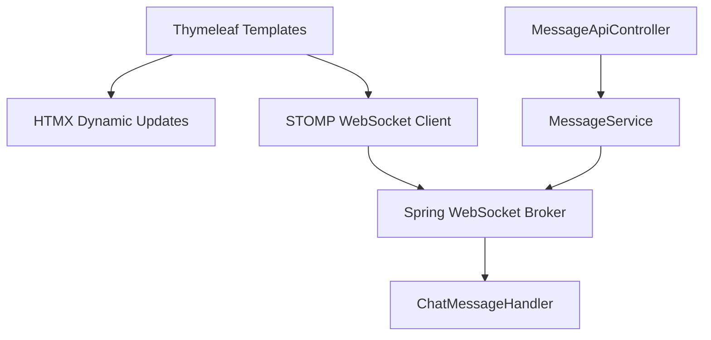

# Design Document: UI/UX Polish Round 4

## Overview

This design covers seven UI/UX improvements and one real-time bug fix for the YAC chat application. The changes span Thymeleaf templates, CSS styling, and JavaScript WebSocket handling. All modifications are localized to the frontend layer (templates, static assets) with one backend change to broadcast message deletion events via STOMP.

### Changes Summary

| # | Change | Files Affected |
|---|--------|---------------|
| 1 | Remove room description from chat header | `chat/room.html` |
| 2 | Remove hover highlight on messages | `css/chat.css` |
| 3 | Separate header section for sidebar buttons | `fragments/sidebar.html` |
| 4 | Expand all accordion sections by default | `fragments/sidebar.html` |
| 5 | Larger message input area | `fragments/message-input.html`, `css/chat.css` |
| 6 | "More" menu for non-owner members | `fragments/sidebar.html`, `chat/room.html` |
| 7 | Real-time message deletion broadcast | `MessageService.java`, `js/stomp-client.js`, `js/app.js` |

## Architecture

The application follows a server-rendered architecture with real-time enhancements:



Requirements 1–6 are purely frontend changes (templates + CSS). Requirement 7 requires a backend change in `MessageService` to broadcast a deletion event via `SimpMessagingTemplate` after a successful delete, plus a client-side handler to remove the DOM element upon receiving the event.

## Components and Interfaces

### Requirement 1: Remove Room Description from Chat Header

**Current state:** The chat header in `chat/room.html` renders both `<h6>` (room name) and `<small>` (room description).

**Change:** Remove the `<small>` element displaying `room.description` from the `.chat-header` div. The right panel (`fragments/member-list.html`) already displays the description under "Room info" — no changes needed there.

Also update the `submitRoomSettings` function in `app.js` which currently updates the `<small>` element in the header after a room settings save — remove that reference.

### Requirement 2: Remove Hover Highlight on Chat Messages

**Current state:** `css/chat.css` contains:
```css
.message-item:hover {
  background: #f0f2f5;
  border-radius: 0.375rem;
}
```

**Change:** Remove or override this rule. The `.message-bubble:hover .message-actions` rule (which shows action buttons on bubble hover) must remain intact.

### Requirement 3: Separate Header Section for Sidebar Action Buttons

**Current state:** In `fragments/sidebar.html`, the "Create room" and "Browse" buttons are at the bottom of the sidebar in a `<div class="d-flex gap-2">` immediately after the Contacts section.

**Change:** Move the buttons into their own labeled section below Contacts with a header label and visual separator:
```html
<hr>
<h6 class="text-uppercase text-muted small">Actions</h6>
<div class="d-flex gap-2">
  <a href="/rooms/create" class="btn btn-outline-primary btn-sm flex-grow-1">Create room</a>
  <a href="/rooms/catalog" class="btn btn-outline-secondary btn-sm flex-grow-1">Browse</a>
</div>
```

### Requirement 4: Expand All Sidebar Accordion Sections by Default

**Current state:** Only "Public Rooms" has `aria-expanded="true"` and `class="collapse show"`. Private Rooms and Direct Messages use `collapsed` button class and `class="collapse"` (hidden by default).

**Change:** For all three accordion items:
- Remove `collapsed` from the button class
- Set `aria-expanded="true"`
- Add `show` to the collapse div class

### Requirement 5: Larger Message Input Area

**Current state:** The textarea in `fragments/message-input.html` has `rows="1"`. The `.message-input` container has `p-2` padding.

**Change:**
- Set `rows="2"` on the textarea
- Increase container padding from `p-2` to `p-3`
- Add a CSS rule for minimum height on the textarea

### Requirement 6: More Menu for Non-Owner Members

**Current state:** Admin actions (block user, add friend) are only available in the right panel's member list dropdown, visible only to OWNER/ADMIN users. Non-admin members have no access to social actions from the sidebar.

**Change:** Add a "More" dropdown in the sidebar (below the Actions section) that is conditionally rendered only when `currentUserRole` is `MEMBER` (not OWNER or ADMIN). The dropdown contains "Block user" and "Add friend" options. These will trigger the existing `blockUser()` and `addFriend()` global functions already defined in `app.js`.

The template needs access to `currentUserRole` — this is already passed to the room template. The sidebar fragment will need this variable passed via a new parameterized fragment or via the model attributes available in the room view context.

**Design decision:** Rather than creating a parameterized sidebar fragment (which would require changing all pages that include the sidebar), we'll use Thymeleaf's inline variable access. Since the sidebar is rendered within `chat/room.html` which already has `currentUserRole` in its model, the fragment can access it directly. The "More" menu will be conditionally shown using `th:if` on the role check.

### Requirement 7: Real-Time Message Deletion via WebSocket Broadcast

**Current state:**
- `MessageApiController.deleteMessage()` calls `messageService.deleteMessage()` and returns HTTP 204
- `handleDeleteMessage()` in `app.js` removes the DOM element on successful HTTP response
- No WebSocket broadcast occurs — other users in the room don't see the deletion until page refresh

**Change (Backend):**
1. Inject `SimpMessagingTemplate` into `MessageService` (or handle in the controller after the service call)
2. After successful deletion, broadcast a deletion event to `/topic/room.{roomId}` with a payload indicating the message was deleted

**Design decision:** Broadcast from the controller layer (not the service) to keep the service focused on business logic. The controller already has access to `roomId`. We'll create a simple DTO for the deletion event.

**Deletion event payload:**
```json
{
  "type": "MESSAGE_DELETED",
  "message_id": "uuid-string",
  "room_id": "uuid-string",
  "deleted_by": "uuid-string"
}
```

**Change (Frontend — `stomp-client.js` / `app.js`):**
- In the room subscription handler, check if the incoming message has `type === 'MESSAGE_DELETED'`
- If so, remove the corresponding `.message-item[data-message-id="..."]` from the DOM
- Update any reply quotes referencing the deleted message

## Data Models

### New DTO: MessageDeletedEvent

```java
public record MessageDeletedEvent(
    String type,
    UUID messageId,
    UUID roomId,
    UUID deletedBy
) {
    public static MessageDeletedEvent of(UUID messageId, UUID roomId, UUID deletedBy) {
        return new MessageDeletedEvent("MESSAGE_DELETED", messageId, roomId, deletedBy);
    }
}
```

This record is serialized to JSON and broadcast via STOMP to `/topic/room.{roomId}`. The client distinguishes it from regular `ChatMessageResponse` messages by checking the `type` field.

No database schema changes are required.

## Error Handling

### Requirement 7 Error Scenarios

| Scenario | Behavior |
|----------|----------|
| DELETE API returns non-204 | Message stays in DOM, error modal shown (existing behavior) |
| WebSocket disconnected during delete | HTTP delete still succeeds; other users get the event on reconnect via gap-fill |
| Stale message ID in deletion event | `querySelector` returns null — no-op, no error |
| User not authorized to delete | Server returns 403, error modal shown (existing behavior) |

For requirements 1–6, no new error scenarios are introduced — these are purely presentational changes.

## Testing Strategy

Since this feature consists primarily of UI template/CSS changes (requirements 1–6) and one integration wiring change (requirement 7), property-based testing is not applicable. The changes are:
- Declarative template modifications (HTML structure)
- CSS rule changes (visual presentation)
- One WebSocket broadcast addition (integration wiring)

None of these involve pure functions with meaningful input variation suitable for PBT.

### Recommended Testing Approach

**Unit Tests:**
- Test that `MessageDeletedEvent.of()` produces correct field values
- Test that `MessageApiController.deleteMessage()` triggers the WebSocket broadcast (MockMvc + mocked `SimpMessagingTemplate`)

**Integration Tests:**
- Verify the full delete flow: HTTP DELETE → 204 response → STOMP broadcast received by subscribers
- Verify that non-members don't receive deletion events

**Manual/Visual Verification (Requirements 1–6):**
- Verify chat header shows only room name + member badge (no description)
- Verify no background change on message hover
- Verify sidebar accordion sections all expanded on page load
- Verify sidebar has labeled "Actions" section with buttons
- Verify message input textarea renders at 2 rows height
- Verify "More" menu appears for MEMBER role users only
- Verify "More" menu does NOT appear for OWNER/ADMIN users

**Browser-based smoke tests:**
- Load a chat room page and verify DOM structure matches expectations
- Delete a message and verify real-time removal across two browser sessions
