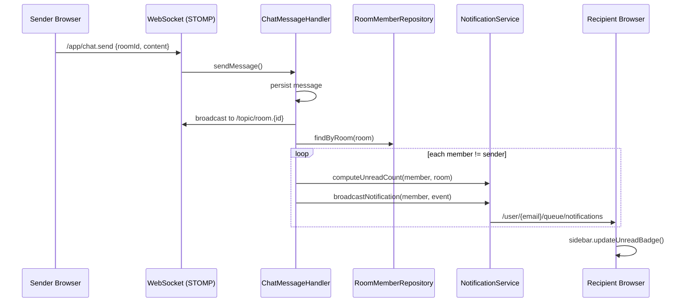
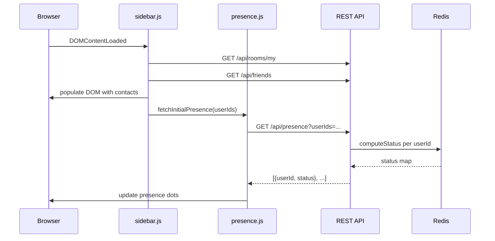

# Design Document: UX Polish and Logic Fixes

## Overview

This design covers 19 requirements addressing UX gaps, broken flows, missing UI elements, access control issues, and data integrity fixes in the YAC chat application. The work spans six categories:

1. **Broken flows**: Password reset link display (Req 1), unread badge clearing (Req 8), unread broadcast on new message (Req 9)
2. **Missing UI elements**: Navbar avatar dropdown (Req 2), reply button (Req 10), room invitation panel (Req 12), user block UI (Req 13), reply quote content (Req 14)
3. **Display fixes**: DM sidebar names (Req 3), initial presence fetch (Req 4), server-rendered message parity (Req 11)
4. **Access control**: Admin action visibility (Req 7), DIRECT visibility protection (Req 5, 15)
5. **New features**: Saved Messages self-DM (Req 6), modern message bubble layout (Req 18, 19)
6. **Data integrity**: DM nextWatermark initialization (Req 16), inline image display (Req 17)

All changes target the existing stack: Spring Boot 4 + Thymeleaf + Bootstrap 5.3 + STOMP.js + vanilla JS. No new external dependencies are introduced.

## Architecture

The application's layered architecture is preserved. Changes touch all layers but introduce no new architectural patterns:

```
┌──────────────────────────────────────────────────────────┐
│  Thymeleaf Templates + Fragments                         │
│  (navbar, sidebar, member-list, room.html, admin-modals) │
├──────────────────────────────────────────────────────────┤
│  Static JS (app.js, stomp-client.js, sidebar.js,         │
│  presence.js) — IIFE pattern on window.YAC.*             │
├──────────────────────────────────────────────────────────┤
│  REST API Controllers (/api/*)                           │
│  Web Controllers (Thymeleaf views)                       │
│  @ControllerAdvice (global model attributes)             │
├──────────────────────────────────────────────────────────┤
│  Service Layer                                           │
├──────────────────────────────────────────────────────────┤
│  JPA Repositories + Redis                                │
└──────────────────────────────────────────────────────────┘
```

### Key Design Decisions

1. **Navbar user injection via `@ControllerAdvice`**: A new `NavbarModelAdvice` class annotated with `@ControllerAdvice` adds the current authenticated `User` object to all models via `@ModelAttribute`. This avoids duplicating user-lookup logic in every web controller. The advice only activates for authenticated requests (checks `SecurityContextHolder`).

2. **MyRoomEntry enrichment for DMs**: Rather than creating a separate DTO for DM sidebar entries, `MyRoomEntry` is extended with optional `otherUsername` and `otherDisplayName` fields. `RoomService.listUserRoomsWithUnread()` populates these for DIRECT rooms by querying room members. The sidebar JS prefers `otherDisplayName` over `otherUsername` over `name` when rendering DM entries.

3. **Presence REST endpoint**: A new `GET /api/presence?userIds=...` endpoint returns batch presence status. This is called once after sidebar/member-list population to set initial presence dots, complementing the existing WebSocket-based real-time updates.

4. **DIRECT visibility guard**: Protection is enforced at two points: `RoomService.updateRoom()` rejects changes to/from DIRECT, and `RoomApiController.createRoom()` rejects DIRECT visibility. The Room Settings modal filters the dropdown client-side as well.

5. **Saved Messages as self-DM**: `DirectChatService` is modified to allow self-DM by removing the self-check. A new `getOrCreateSavedMessages(User)` method wraps this. The room has a single `RoomMember` entry. `listDirectChats()` handles the missing "other user" case. `checkDirectChatBan()` skips ban checks for single-member rooms.

6. **Admin action visibility via room role**: `ChatWebController` resolves the current user's `RoomRole` and passes it to the template as `currentUserRole`. The member-list fragment uses `th:if` conditions on this value to show/hide admin actions, invite button, and banned users button.

7. **Unread broadcast after message send**: `ChatMessageHandler.sendMessage()` is extended to query room members, compute unread counts for non-sender members, and broadcast `NotificationEvent` to each via their personal WebSocket queue.

8. **Reply quote enrichment**: `ChatMessageResponse` gains `replyToSenderUsername` and `replyToContentSnippet` fields. `MessageService.toResponse()` populates these from the `replyTo` message entity. The snippet is the first 100 characters of the original content.

9. **Message bubble layout**: CSS classes `.message-own` and `.message-other` control left/right alignment. Own messages get a blue bubble (`#d1ecf1`) right-aligned; others get a white bubble left-aligned. Avatar is outside the bubble. Username+timestamp above. Actions appear on hover. Both Thymeleaf and JS rendering use the same class structure.

10. **Inline image display**: `AttachmentApiController` checks `contentType` — if it starts with `image/`, the `Content-Disposition` header is set to `inline`; otherwise `attachment`.

### Component Interaction: Unread Broadcast Flow



### Component Interaction: Presence Initialization Flow



## Components and Interfaces

### Req 1: Password Reset Link Display

**AuthWebController change**: Modify `forgotPasswordPost()` to capture the raw token from `passwordService.createResetToken()` and pass the full reset link to the model when the user exists.

```java
@PostMapping("/forgot-password")
public String forgotPasswordPost(@RequestParam String email,
                                 RedirectAttributes redirectAttributes,
                                 Model model) {
    Optional<User> user = userRepository.findByEmail(email);
    if (user.isPresent()) {
        String rawToken = passwordService.createResetToken(user.get());
        String resetLink = "/reset-password?token=" + rawToken;
        redirectAttributes.addFlashAttribute("resetLink", resetLink);
    }
    redirectAttributes.addFlashAttribute("success",
            "If an account with that email exists, a password reset link has been sent.");
    return "redirect:/forgot-password";
}
```

**forgot-password.html change**: Add conditional rendering of the reset link:
```html
<div th:if="${resetLink}" class="alert alert-info">
  <span>Reset link: </span>
  <a th:href="${resetLink}" th:text="${resetLink}">link</a>
</div>
```

### Req 2: Navbar Avatar Dropdown

**New class**: `NavbarModelAdvice` in `com.bovae.yac.config`

```java
@ControllerAdvice
@RequiredArgsConstructor
public class NavbarModelAdvice {
    private final UserRepository userRepository;

    @ModelAttribute("navbarUser")
    public User navbarUser() {
        Authentication auth = SecurityContextHolder.getContext().getAuthentication();
        if (auth != null && auth.isAuthenticated()
                && !(auth instanceof AnonymousAuthenticationToken)) {
            return userRepository.findByEmail(auth.getName()).orElse(null);
        }
        return null;
    }
}
```

**navbar.html change**: Replace the flat "Sign out" button with an avatar dropdown:
- Avatar circle: first letter of username, same style as message avatars (36px, `bg-secondary`, white text)
- Dropdown items: Profile (`/profile`), Sessions (`/profile/sessions`), divider, Sign out (POST `/logout`)
- Use `th:if="${navbarUser != null}"` to conditionally render

### Req 3: DM Sidebar Display

**MyRoomEntry modification**: Add optional fields:
```java
public record MyRoomEntry(
    UUID id,
    String name,
    RoomVisibility visibility,
    int unreadCount,
    String otherUsername,
    String otherDisplayName
) {}
```

**RoomService.listUserRoomsWithUnread() change**: For DIRECT rooms, query `roomMemberRepository.findByRoomWithUsers(room)` and find the member whose ID differs from the current user. Populate `otherUsername` and `otherDisplayName`. For self-DM (single member), set both to null.

**sidebar.js change**: When rendering DIRECT rooms, use `room.other_display_name || room.other_username || room.name` as the display text. For self-DM (both null), display "Saved Messages 🔖".

### Req 4: Initial Presence Fetch

**New class**: `PresenceApiController` in `controller/api/`

```java
@Validated
@RestController
@RequestMapping("/api/presence")
@RequiredArgsConstructor
public class PresenceApiController {
    private final PresenceService presenceService;

    @GetMapping
    public ResponseEntity<List<PresenceStatusEntry>> getPresence(
            @RequestParam String userIds) {
        List<UUID> ids = Arrays.stream(userIds.split(","))
                .map(String::trim)
                .filter(s -> !s.isEmpty())
                .map(UUID::fromString)
                .toList();
        List<PresenceStatusEntry> result = ids.stream()
                .map(id -> new PresenceStatusEntry(id, presenceService.getUserStatus(id)))
                .toList();
        return ResponseEntity.ok(result);
    }

    public record PresenceStatusEntry(UUID userId, PresenceStatus status) {}
}
```

**presence.js change**: Add `fetchInitialPresence(userIds)` function that calls `GET /api/presence?userIds=...` and updates all matching presence dots. Called from `sidebar.js` after populating contacts and from `room.html` after member list renders.

### Req 5: Prevent DIRECT Visibility Conversion

**RoomService.updateRoom() change**: Add guards:
```java
if (room.getVisibility() == RoomVisibility.DIRECT) {
    throw new ForbiddenException("DIRECT rooms cannot be modified through room settings");
}
if (visibility == RoomVisibility.DIRECT) {
    throw new ForbiddenException("Rooms cannot be converted to DIRECT visibility");
}
```

**admin-modals.html change**: Filter visibility dropdown to exclude DIRECT:
```html
<option th:each="v : ${T(com.bovae.yac.model.enums.RoomVisibility).values()}"
        th:if="${v.name() != 'DIRECT'}"
        th:value="${v.name()}" th:text="${v.name()}"
        th:selected="${v == room.visibility}">
</option>
```

### Req 6: Saved Messages (Self-DM)

**DirectChatService changes**:
- Remove the self-check in `getOrCreateDirectChat()` that throws `ForbiddenException("Cannot create a direct chat with yourself")`
- Add `getOrCreateSavedMessages(User user)` method that calls `getOrCreateDirectChat(user, user)` internally, but with special handling: skip friendship check, skip ban check, create room with single member
- Modify `listDirectChats()` to handle rooms where `otherUser` is absent (single-member DIRECT room) — return a `DirectChatDto` with the user's own info and name "Saved Messages"
- Modify `checkDirectChatBan()` in `MessageService` to skip ban check when room has only one member

**sidebar.html change**: Add a "Saved Messages" quick-access button below the DM accordion header.

**sidebar.js change**: Add a click handler for the Saved Messages button that POSTs to a new endpoint `POST /api/direct-chats/saved` and navigates to the room.

**DirectChatApiController change**: Add `POST /api/direct-chats/saved` endpoint.

### Req 7: Restrict Admin Actions

**ChatWebController.roomView() change**: Resolve the current user's room role and add to model:
```java
RoomRole currentUserRole = roomMemberService.listMembers(room).stream()
        .filter(m -> m.userId().equals(user.getId()))
        .map(RoomMemberDto::role)
        .findFirst()
        .orElse(null);
model.addAttribute("currentUserRole", currentUserRole);
```

**member-list.html changes**:
- Admin actions dropdown: `th:if="${currentUserRole != null and (currentUserRole.name() == 'OWNER' or currentUserRole.name() == 'ADMIN')} and ${currentUser.id != member.userId}"`
- Invite user button: `th:if="${currentUserRole != null and (currentUserRole.name() == 'OWNER' or currentUserRole.name() == 'ADMIN')}"`
- View banned users button: `th:if="${currentUserRole != null and (currentUserRole.name() == 'OWNER' or currentUserRole.name() == 'ADMIN')}"`

### Req 8: Clear Unread on Room View

**ChatWebController.roomView() change**: After confirming membership, call:
```java
if (isMember) {
    notificationService.markRoomAsRead(user, room);
}
```

Requires injecting `NotificationService` into `ChatWebController`.

### Req 9: Unread Broadcast on New Message

**ChatMessageHandler changes**: After broadcasting the message, compute and send unread notifications:
```java
// After messagingTemplate.convertAndSend(...)
List<RoomMember> members = roomMemberRepository.findByRoom(room);
for (RoomMember member : members) {
    if (!member.getUser().getId().equals(sender.getId())) {
        int unread = notificationService.computeUnreadCount(member.getUser(), room);
        NotificationEvent event = new NotificationEvent(
                "UNREAD_UPDATE", room.getId(), room.getName(), unread);
        notificationService.broadcastNotification(member.getUser(), event);
    }
}
```

Requires injecting `RoomMemberRepository` and `NotificationService` into `ChatMessageHandler`.

### Req 10: Reply Button on Messages

**room.html change**: Add reply button to server-rendered messages (visible on all messages):
```html
<button class="btn btn-sm btn-outline-secondary reply-btn"
        th:attr="data-message-id=${msg.id()},data-sender-username=${msg.senderUsername()}"
        title="Reply">↩</button>
```

**app.js change**: Add reply button to `createMessageElement()` for all messages (not just own). Wire click handler to populate `#reply-to-id`, show reply indicator with sender name, and focus textarea.

### Req 11: Server-Rendered Message Parity

**room.html changes**:
- Edit button: `th:if="${msg.senderId() == currentUser.id}"` — add ✏️ button with `data-message-id`
- Admin delete button: `th:if="${msg.senderId() != currentUser.id and (currentUserRole.name() == 'OWNER' or currentUserRole.name() == 'ADMIN')}"` — add 🗑 button
- Attachment rendering: iterate `msg.attachments()`, render `` for images, `<a>` for files
- Reply quote enrichment: use `msg.replyToSenderUsername()` and `msg.replyToContentSnippet()` (see Req 14)

**ChatWebController change**: Pass `currentUserRole` to model (already done in Req 7).

### Req 12: Room Invitation Panel

**New repository method**: `RoomInvitationRepository.findByInvitee(User invitee)` — returns all pending invitations for a user.

**New endpoint**: `GET /api/rooms/invitations/pending` on a new or existing controller:
```java
@GetMapping("/api/rooms/invitations/pending")
public ResponseEntity<List<PendingInvitationDto>> pendingInvitations(Principal principal) {
    User user = resolveUser(principal);
    List<RoomInvitation> invitations = roomInvitationRepository.findByInvitee(user);
    // Map to DTO with roomId, roomName, inviterUsername
    return ResponseEntity.ok(dtos);
}
```

**sidebar.js change**: After populating friend requests, fetch `GET /api/rooms/invitations/pending`. If non-empty, render a "Room Invitations" section with room name, inviter, accept/decline buttons.

### Req 13: User Block UI

**member-list.html change**: Add "Block user" option to the admin actions dropdown for non-self members:
```html
<li th:if="${member.userId != currentUser.id}">
    <button class="dropdown-item small text-danger" type="button"
            th:attr="data-user-id=${member.userId},data-username=${member.username}"
            onclick="blockUser(this)">Block user</button>
</li>
```

**app.js change**: Add `window.blockUser` function:
- Show confirmation modal
- On confirm: `POST /api/user-bans` with `{ user_id: userId }`
- On 201: show success feedback
- On error: show error modal

### Req 14: Reply Quote Content

**ChatMessageResponse modification**: Add fields:
```java
public record ChatMessageResponse(
    UUID id, UUID roomId, UUID senderId, String senderUsername,
    String content, UUID replyToId,
    String replyToSenderUsername,   // NEW
    String replyToContentSnippet,   // NEW
    boolean edited, Long watermark, Instant createdAt,
    List<AttachmentInfo> attachments
) {}
```

**MessageService.toResponse() change**: When `message.getReplyTo() != null`, populate:
- `replyToSenderUsername` = `message.getReplyTo().getSender().getUsername()`
- `replyToContentSnippet` = first 100 chars of `message.getReplyTo().getContent()`

When `replyTo` is null or deleted, set both to null.

**room.html change**: Update reply quote rendering:
```html
<div th:if="${msg.replyToId() != null}" class="reply-quote ...">
    <span th:if="${msg.replyToSenderUsername() != null}">
        Replying to <strong th:text="${msg.replyToSenderUsername()}">User</strong>:
        <span th:text="${msg.replyToContentSnippet()}">snippet</span>
    </span>
    <span th:unless="${msg.replyToSenderUsername() != null}">Original message deleted</span>
</div>
```

**app.js change**: Update reply quote rendering in `createMessageElement()` to use `msg.reply_to_sender_username` and `msg.reply_to_content_snippet`.

### Req 15: Prevent DIRECT Room Creation via API

**RoomApiController.createRoom() change**: Add validation before delegation:
```java
if (request.visibility() == RoomVisibility.DIRECT) {
    return ResponseEntity.badRequest().build();
}
```

### Req 16: Initialize nextWatermark on DM Creation

**DirectChatService.getOrCreateDirectChat() change**: Set `nextWatermark` on the Room builder:
```java
Room room = Room.builder()
        .name(roomName)
        .visibility(RoomVisibility.DIRECT)
        .owner(userA)
        .nextWatermark(1L)
        .build();
```

Note: The `Room` entity already has `@Builder.Default` setting `nextWatermark = 1L`, but the current `DirectChatService` code doesn't explicitly set it. The `@Builder.Default` should handle this, but we'll add the explicit set for clarity and safety.

### Req 17: Inline Image Display

**AttachmentApiController.downloadFile() change**: Determine disposition based on content type:
```java
String disposition = (contentType != null && contentType.startsWith("image/"))
        ? "inline" : "attachment";
return ResponseEntity.ok()
        .contentType(MediaType.parseMediaType(contentType))
        .header(HttpHeaders.CONTENT_DISPOSITION,
                disposition + "; filename=\"%s\"".formatted(attachment.getOriginalFileName()))
        .body(resource);
```

### Req 18-19: Modern Message Bubble Layout

**CSS changes** (`chat.css`): Add message bubble styles:
- `.message-own`: `flex-direction: row-reverse`, blue bubble (`#d1ecf1`), right-aligned text
- `.message-other`: `flex-direction: row`, white bubble with border, left-aligned text
- `.message-bubble`: `max-width: 70%`, `border-radius: 12px`, `padding: 8px 12px`, subtle shadow
- `.message-item .message-actions`: `opacity: 0` by default, `opacity: 1` on `.message-item:hover`
- Avatar: 36px circle outside bubble

**room.html change**: Update server-rendered messages to use bubble layout:
```html
<div th:each="msg : ${messages}"
     class="message-item d-flex mb-3"
     th:classappend="${msg.senderId() == currentUser.id} ? 'message-own' : 'message-other'"
     th:attr="data-message-id=${msg.id()},data-watermark=${msg.watermark()}">
```

**app.js change**: Update `createMessageElement()` to apply `message-own` or `message-other` class based on `senderId === YAC_USER.id`. Restructure DOM to: avatar outside, bubble wrapper inside containing header + reply quote + text + attachments.

## Data Models

### Modified DTOs

```java
// MyRoomEntry — add DM display fields (Req 3)
public record MyRoomEntry(
    UUID id,
    String name,
    RoomVisibility visibility,
    int unreadCount,
    String otherUsername,       // NEW — populated for DIRECT rooms
    String otherDisplayName    // NEW — populated for DIRECT rooms
) {}

// ChatMessageResponse — add reply quote fields (Req 14)
public record ChatMessageResponse(
    UUID id,
    UUID roomId,
    UUID senderId,
    String senderUsername,
    String content,
    UUID replyToId,
    String replyToSenderUsername,   // NEW
    String replyToContentSnippet,  // NEW
    boolean edited,
    Long watermark,
    Instant createdAt,
    List<AttachmentInfo> attachments
) {}
```

### New DTOs

```java
// Presence batch response entry (Req 4)
public record PresenceStatusEntry(
    UUID userId,
    PresenceStatus status
) {}

// Pending room invitation DTO (Req 12)
public record PendingInvitationDto(
    UUID invitationId,
    UUID roomId,
    String roomName,
    String inviterUsername,
    Instant createdAt
) {}
```

### New/Modified API Endpoints

| Method | Path | Req | Description |
|--------|------|-----|-------------|
| `GET` | `/api/presence?userIds=...` | 4 | Batch presence status lookup |
| `POST` | `/api/direct-chats/saved` | 6 | Get or create Saved Messages room |
| `GET` | `/api/rooms/invitations/pending` | 12 | List pending room invitations for current user |

### New/Modified Service Methods

| Service | Method | Req | Description |
|---------|--------|-----|-------------|
| `RoomService` | `listUserRoomsWithUnread()` (modified) | 3 | Populate DM display names |
| `RoomService` | `updateRoom()` (modified) | 5 | Guard against DIRECT visibility changes |
| `DirectChatService` | `getOrCreateSavedMessages(User)` | 6 | Self-DM creation |
| `DirectChatService` | `getOrCreateDirectChat()` (modified) | 6 | Allow self-DM |
| `DirectChatService` | `listDirectChats()` (modified) | 6 | Handle self-DM entries |
| `MessageService` | `checkDirectChatBan()` (modified) | 6 | Skip ban check for self-DM |
| `MessageService` | `toResponse()` (modified) | 14 | Populate reply quote fields |
| `NotificationService` | `markRoomAsRead()` (existing) | 8 | Called from ChatWebController |
| `NotificationService` | `computeUnreadCount()` (existing) | 9 | Called from ChatMessageHandler |

### New Classes

| Class | Package | Req | Description |
|-------|---------|-----|-------------|
| `NavbarModelAdvice` | `config` | 2 | `@ControllerAdvice` injecting `navbarUser` into all models |
| `PresenceApiController` | `controller/api` | 4 | `GET /api/presence` batch endpoint |

### Database Schema

No schema changes required. All existing tables support the new functionality.

### New Repository Methods

```java
// RoomInvitationRepository (Req 12)
List<RoomInvitation> findByInvitee(User invitee);
```


## Correctness Properties

*A property is a characteristic or behavior that should hold true across all valid executions of a system — essentially, a formal statement about what the system should do. Properties serve as the bridge between human-readable specifications and machine-verifiable correctness guarantees.*

The following properties were derived from the acceptance criteria prework analysis. After initial identification, a reflection pass consolidated redundant properties (e.g., DM display name preference and DTO enrichment merged; DIRECT visibility guards merged; self-DM creation/membership/listing merged; admin visibility criteria for multiple buttons merged; reply quote DTO and rendering merged; Content-Disposition and content type merged; message alignment for own/other and cross-renderer consistency merged).

### Property 1: NavbarUser model attribute injection

*For any* authenticated HTTP request to a Thymeleaf-rendered page, the model SHALL contain a `navbarUser` attribute equal to the authenticated `User` entity. *For any* anonymous or unauthenticated request, the `navbarUser` attribute SHALL be null.

**Validates: Requirements 2.6**

### Property 2: DM room entry display name resolution

*For any* `MyRoomEntry` returned by `listUserRoomsWithUnread()` with `visibility == DIRECT`, if the room has two distinct members, `otherUsername` SHALL be non-null and equal to the other member's username, and `otherDisplayName` SHALL equal the other member's display name (or null if unset). If the room is a self-DM (single member), both `otherUsername` and `otherDisplayName` SHALL be null. *For any* entry with `visibility != DIRECT`, both fields SHALL be null.

**Validates: Requirements 3.1, 3.2, 3.3, 3.4**

### Property 3: Presence batch endpoint correctness

*For any* set of user IDs passed to `GET /api/presence`, the response SHALL contain exactly one entry per requested ID, and each entry's `status` field SHALL equal the value returned by `PresenceService.getUserStatus(userId)` at the time of the request.

**Validates: Requirements 4.1, 4.4, 4.5**

### Property 4: DIRECT visibility immutability

*For any* room with `visibility == DIRECT`, calling `updateRoom()` with any combination of fields SHALL throw `ForbiddenException`. *For any* room with `visibility != DIRECT`, calling `updateRoom()` with `visibility = DIRECT` SHALL throw `ForbiddenException`. *For any* `CreateRoomRequest` with `visibility = DIRECT`, the room creation endpoint SHALL reject with HTTP 400.

**Validates: Requirements 5.1, 5.2, 5.4, 15.1**

### Property 5: Self-DM (Saved Messages) lifecycle

*For any* valid user, calling `getOrCreateSavedMessages(user)` SHALL return a `RoomDto` with `visibility == DIRECT`. The created room SHALL have exactly one `RoomMember` entry. Calling `getOrCreateSavedMessages(user)` again SHALL return the same room (idempotent). The room SHALL appear in `listDirectChats(user)` results. Sending a message in the self-DM room SHALL not throw a ban-related exception regardless of any `UserBan` entries involving the user.

**Validates: Requirements 6.1, 6.2, 6.5, 6.6**

### Property 6: Admin action visibility by room role

*For any* room member list rendering, if the current user's room role is `OWNER` or `ADMIN`, the admin actions dropdown, "Invite user" button, and "View banned users" button SHALL be visible. If the current user's role is `MEMBER` or the user is not a member, those elements SHALL be hidden.

**Validates: Requirements 7.1, 7.2, 7.3, 7.4**

### Property 7: Room view clears unread count

*For any* authenticated user who is a member of a room, after the `ChatWebController` renders the room view, the user's unread count for that room (as computed by `NotificationService.computeUnreadCount()`) SHALL be 0.

**Validates: Requirements 8.1, 8.2, 8.3**

### Property 8: Unread notification broadcast on new message

*For any* room with N members, when a message is sent by one member, exactly N-1 `NotificationEvent` messages of type `UNREAD_UPDATE` SHALL be broadcast — one to each non-sender member's personal WebSocket queue. Each event SHALL contain the room's ID and the recipient's current unread count.

**Validates: Requirements 9.1, 9.2, 9.3**

### Property 9: Reply quote DTO enrichment

*For any* message with a non-null `replyTo` reference, the `ChatMessageResponse` SHALL have `replyToSenderUsername` equal to the replied-to message's sender username, and `replyToContentSnippet` equal to the first 100 characters of the replied-to message's content. *For any* message with a null `replyTo`, both fields SHALL be null.

**Validates: Requirements 14.1, 14.2, 14.3**

### Property 10: DM room nextWatermark initialization

*For any* direct chat room created via `DirectChatService.getOrCreateDirectChat()`, the persisted `Room` entity SHALL have `nextWatermark == 1L`, matching the initial value set by `RoomService.createRoom()`.

**Validates: Requirements 16.1, 16.2**

### Property 11: Content-Disposition based on attachment content type

*For any* attachment download response, if the attachment's `contentType` starts with `image/`, the `Content-Disposition` header SHALL be `inline; filename="..."`. *For any* attachment whose `contentType` does not start with `image/` (or is null), the header SHALL be `attachment; filename="..."`.

**Validates: Requirements 17.1, 17.2, 17.3**

### Property 12: Message alignment class assignment

*For any* message rendered by either the Thymeleaf template or the JavaScript `createMessageElement()` function, if `senderId` equals the current user's ID, the message element SHALL have CSS class `message-own`. If `senderId` does not equal the current user's ID, the element SHALL have CSS class `message-other`. Both renderers SHALL produce the same class for the same message and user combination.

**Validates: Requirements 18.1, 18.2, 18.8, 18.9**

## Error Handling

### Backend Error Handling

All errors follow the existing `GlobalApiExceptionHandler` pattern returning `ErrorResponse` records:

| Scenario | Exception | HTTP Status | Message |
|----------|-----------|-------------|---------|
| Update DIRECT room | `ForbiddenException` | 403 | "DIRECT rooms cannot be modified through room settings" |
| Set visibility to DIRECT | `ForbiddenException` | 403 | "Rooms cannot be converted to DIRECT visibility" |
| Create room with DIRECT | `IllegalArgumentException` | 400 | "DIRECT rooms cannot be created through this endpoint" |
| Self-DM ban check | Skipped | N/A | No exception thrown for self-DM rooms |
| Invalid UUID in presence query | `IllegalArgumentException` | 400 | Standard validation error |
| Non-member views room | No `markRoomAsRead` call | N/A | Unread marker not modified |
| Reply-to message deleted | Null fields | N/A | `replyToSenderUsername` and `replyToContentSnippet` set to null |

### Frontend Error Handling

| Scenario | Behavior |
|----------|----------|
| Presence fetch fails | Dots remain gray (default), logged to console |
| Block user API error | Error modal displayed with server message |
| Room invitation accept/decline error | Error message shown inline in invitation panel |
| Saved Messages creation fails | Error modal displayed |
| Sidebar room/contact fetch fails | Existing "No rooms yet" / "No contacts yet" placeholders remain |

### Edge Cases

- **Self-DM with existing user bans**: `checkDirectChatBan()` skips when room has ≤1 distinct member
- **Deleted reply-to message**: Template and JS both check for null `replyToSenderUsername` and show "Original message deleted"
- **Empty presence userIds parameter**: Returns empty array, no error
- **NavbarUser for anonymous pages**: `NavbarModelAdvice` returns null, template conditionally hides avatar dropdown
- **Room with no members (orphaned)**: `computeUnreadCount` returns 0, no notifications broadcast

## Testing Strategy

### Dual Testing Approach

This feature uses both unit tests and property-based tests:

- **Property-based tests (jqwik)**: Validate universal properties across generated inputs (Properties 1-12)
- **Unit tests (JUnit 5 + MockMvc)**: Verify specific examples, edge cases, UI rendering, and integration points
- **Integration tests (Testcontainers)**: Verify end-to-end flows with real PostgreSQL and Redis

### Property-Based Testing Configuration

- Library: **jqwik 1.9.3** (already in pom.xml)
- Minimum **100 iterations** per property test
- Each test tagged with: `Feature: ux-polish-and-logic-fixes, Property {number}: {title}`
- Tests located in `src/test/java/com/bovae/yac/property/`

### PBT Applicability Assessment

PBT is appropriate for this feature because:
- Multiple properties involve pure logic with clear input/output behavior (DTO enrichment, role-based visibility, content-type branching, alignment class assignment)
- Input spaces are large (random usernames, display names, content types, room roles, message content)
- Properties are universally quantified ("for all rooms", "for any user", "for any attachment")

Properties 1-12 are all suitable for PBT. Frontend-only properties (12) can be validated by testing the underlying data/logic layer that drives the rendering.

### Property Test Plan

| Property | Test Class | Key Generators |
|----------|-----------|----------------|
| P1: NavbarUser injection | `NavbarModelAdvicePropertyTest` | Random User entities, authenticated vs anonymous |
| P2: DM display name resolution | `DmDisplayNamePropertyTest` | Random users with/without displayName, DIRECT/PUBLIC/PRIVATE rooms, self-DM |
| P3: Presence batch correctness | `PresenceBatchPropertyTest` | Random UUID sets, random PresenceStatus values |
| P4: DIRECT visibility immutability | `DirectVisibilityGuardPropertyTest` | Random UpdateRoomRequest fields, DIRECT and non-DIRECT rooms |
| P5: Self-DM lifecycle | `SavedMessagesPropertyTest` | Random users |
| P6: Admin action visibility | `AdminActionVisibilityPropertyTest` | Random RoomRole values (OWNER, ADMIN, MEMBER, null) |
| P7: Room view clears unread | `RoomViewUnreadPropertyTest` | Random rooms with random watermarks and unread counts |
| P8: Unread broadcast | `UnreadBroadcastPropertyTest` | Random room member counts (2-20), random sender selection |
| P9: Reply quote enrichment | `ReplyQuotePropertyTest` | Random message content (0-3072 bytes), random sender usernames, null/non-null replyTo |
| P10: DM nextWatermark | `DmWatermarkPropertyTest` | Random user pairs |
| P11: Content-Disposition | `AttachmentDispositionPropertyTest` | Random content types (image/png, image/jpeg, application/pdf, text/plain, null) |
| P12: Message alignment class | `MessageAlignmentPropertyTest` | Random senderIds, random currentUserIds, equality/inequality |

### Unit Test Plan

Unit tests cover specific examples and edge cases not suited for PBT:

- **Req 1**: MockMvc test for forgot-password POST with existing/non-existing email
- **Req 2**: Template rendering test for navbar with/without navbarUser
- **Req 5**: MockMvc test for POST /api/rooms with DIRECT visibility → 400
- **Req 6**: Self-DM idempotency test (create twice, same room returned)
- **Req 10**: Template rendering test for reply button presence on all messages
- **Req 11**: Template rendering test for edit button on own messages, admin delete on others
- **Req 12**: MockMvc test for GET /api/rooms/invitations/pending
- **Req 14**: Edge case test for deleted reply-to message (null fields)
- **Req 18-19**: CSS class verification in rendered HTML
